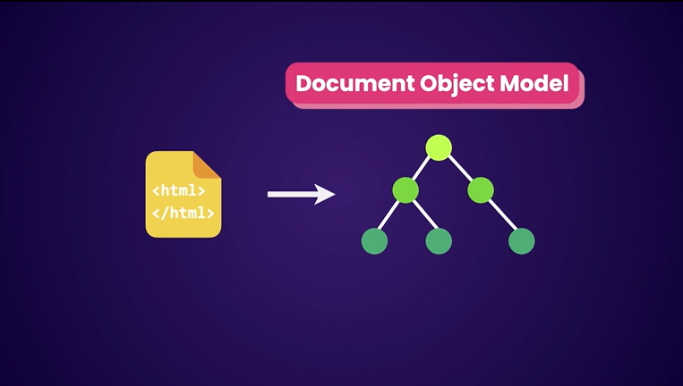
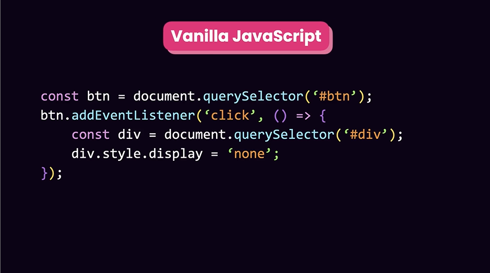
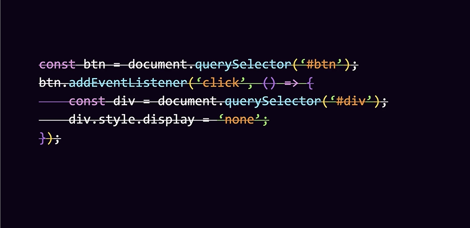
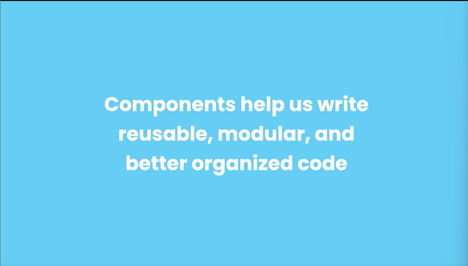
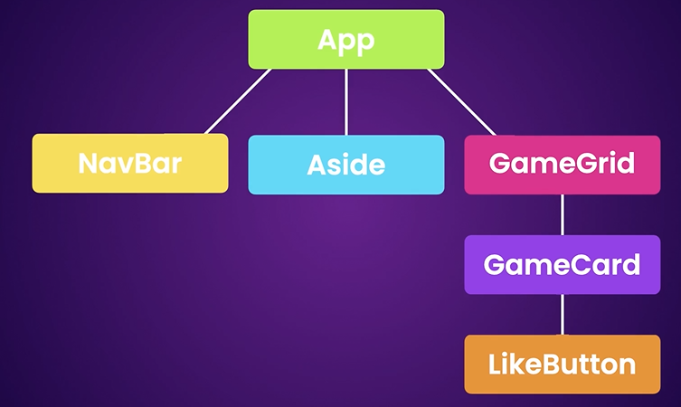
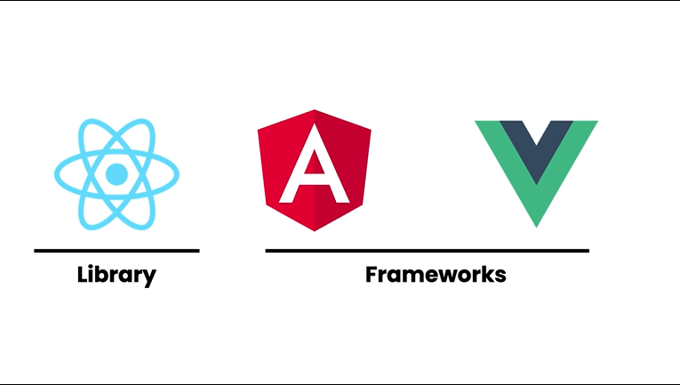
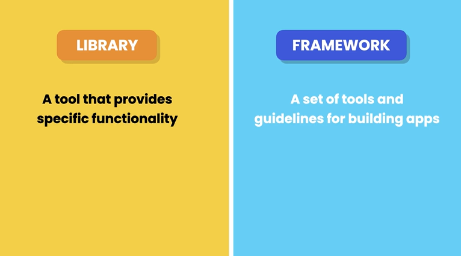
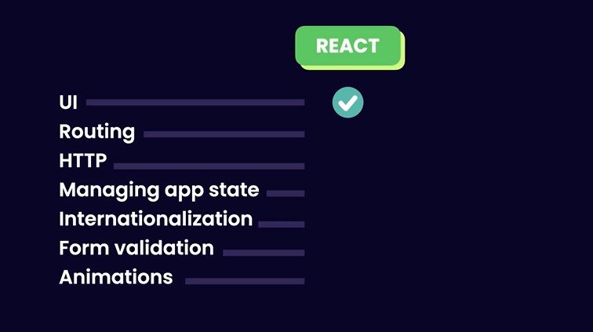

## **What is React?**
- React is a JavaScript library for building dynamic and interactive UI.

- Created by FB in 2011.

- Why was React created?
  When a webpage is loaded in a browser, the browser takes the HTML code and create a tree-like structure called the Document Object Model (DOM). This allows us to use Js to change the page content in response to user action.
  

- For example, we can use Js to hide an element when button is clicked. Also called Vanilla Js meaning plain Js code without any third party library.
  

- So as our apps grow, working with DOM is challenged and that comes React to solve. So doesn't need to play around with DOM.

- When we use React, we no longer use Vanilla Js. With React we no longer need to worry about querying and updating the DOM element.
  

- Instead we describe a webpage using small and reusable components and React will take care efficiently creating and updating elements.
  

- We build components individually and independent.
  

## **Creating React App (packages)**
There are 2 ways to create React :

1. Create React App(CRA)
2. Vite

## **Project Structure**
- node_modules folder : This is where all the third party libraries like React and other tools are installed.
- public folder : This is where our public asset of our app is stored like images,videos and so on.
- src folder : Source code of our application.
- index.html file : Basic HTML template
- package.json : Information about our project.
- tsconfig.json : A bunch of setting for telling the Ts compiler how to compile our code to Js.
- vite.config.ts : Configuration file for vite.

## **Creating a React Components**
- There are 2 ways to create a React component, either by Js class or function.
- So we use function, declare a function named message. Use PascalCasing for the components name.
```
function Message (){

}
```
- Then, we should describe what the component should look like when we use this component. For example we want to display H1 element and some text. So we write:
```
function Message() {
    const name = 'Syakir';
     return <h1>Hello {name}</h1>;
}

export default Message; //export as default object on this module
```
- `return <h1>Hello {name}</h1>;` is not HTML code,but JSX that stands for Javascript XML. This code will be converted to Js code. Head over to babeljs.io to find out more.
- We can write any Js Expressions inside the curly braces `{ }`
- Now, in App.tsx, we define a function
```
function () {
  return <div><div/>
  
}
```
- Then let say we want to have a div and inside the div we want to have our message component.
```
import Message from "./Message";

function App() {
  return <div>
    <Message/>
  </div>
}

export default App;
```

## **How React Works**
- Component like App.tsx being the root or parent component, component like Message.tsx being the tree or child.
- Then React take this component tree and build Js data structure called Virtual DOM. This DOM differ from the actual DOM in the browser. It is lightweight and in memory representation of our component tree and each node represent a component and its properties.


- When the state or data of our component changes, React updates the corresponding nodes in the Virtual DOM to a new state then compares the current version of the virtual DOM with previous version to identify the nodes that should be updated. (This is monitored by vite)
- It will then updates the nodes in the actual DOM. This process will be done by React DOM(can see in package.json>dependencies - 2 libraries that are react and react-dom).


## **React Ecosystem**




- Library is like a tool, and frameworks is like a toolset.

- The only thing React good is creating a dynamic and interacting UI



- Later on will cover third party library in React Ecosystem.
