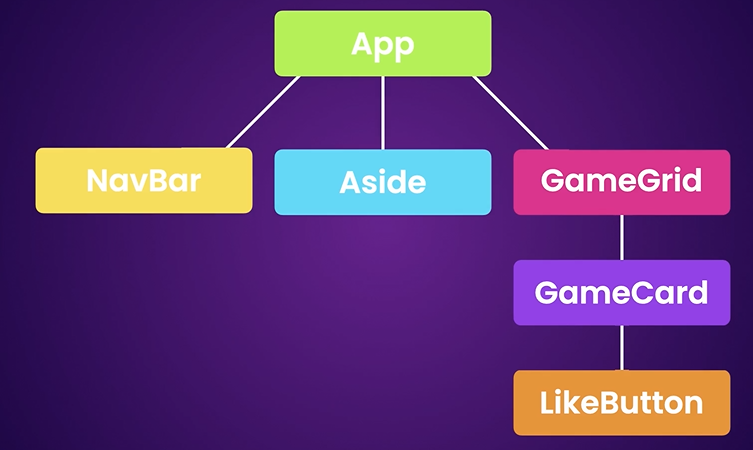
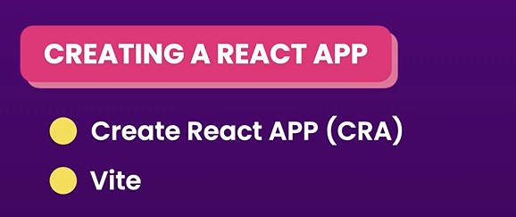
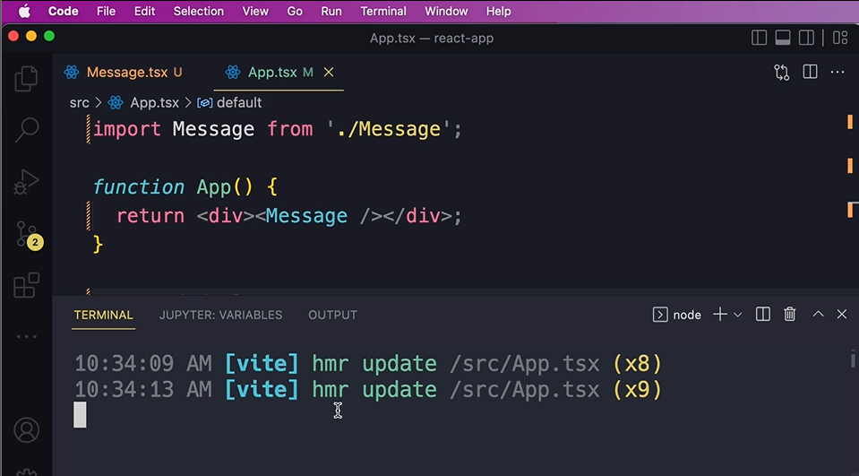
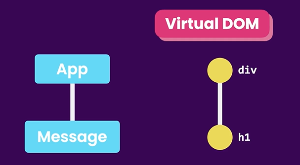
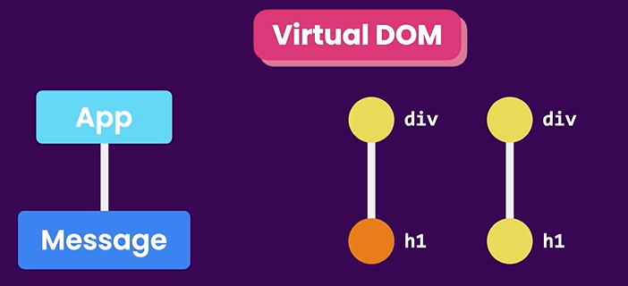
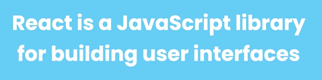
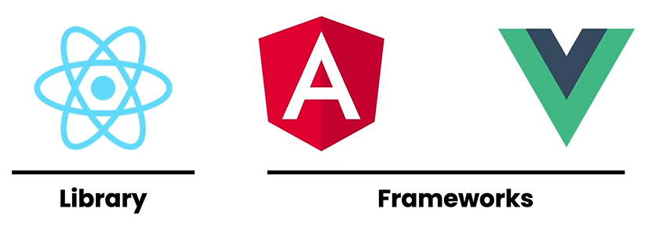
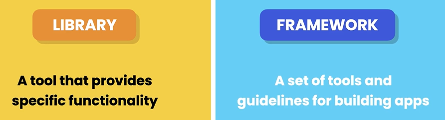

## What is react?

Vanilla Js means plain text js when there is no third party library or tools.



node -v on terminal to check the node version
ctrl ` to open and close terminal in vscode

## Creating React app (packages)

2 ways :
1. Create React App(CRA)
2. Vite



## Creating a React components
 App.tsx is app component



hmr means Hot Module Replacement
vite monitor for our changes

```
Message.tsx

function Message() { //pascalCasing
    const name = 'Syakir';
     return <h1>Hello {name}</h1>; //This is not HTML code,but JSX: Javascript XML.This code will be converted to Js code,head over to babeljs.io to find out more.
     //{ } we can write any Js Expressions inside the curly braces

}

export default Message;
```

```
App.tsx

import Message from "./Message"; //need to import first


function App() {
  return <div><Message/></div>
}

export default App;

```

## How React Works
* App.tsx being the root or parent component, Message.tsx being the tree or child.
* Then React take this component tree and build Js data structure called Virtual DOM. This DOM differ from the actual DOM in the browser. It is lightweight and in memory representation of our component tree and each node represent a component and its properties.



* When the state or data of our component changes,React updates the corresponding nodes in the Virtual DOM to a new state then compares the current version of the virtual DOM with previous version to identify the nodes that should be updated. 
* It will then updates the nodes in the actual DOM. This process will be done by React DOM(can see in package.json>dependencies - 2 libraries that are react and react-dom).



## React Ecosystem







Library is like a tool and framework is like a toolset.

React to create a dynamic and interacting UI


