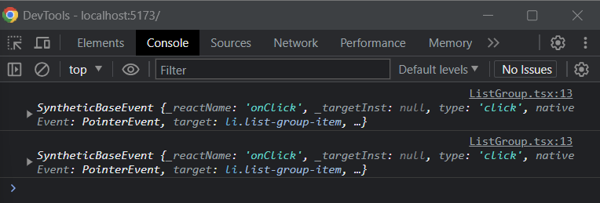
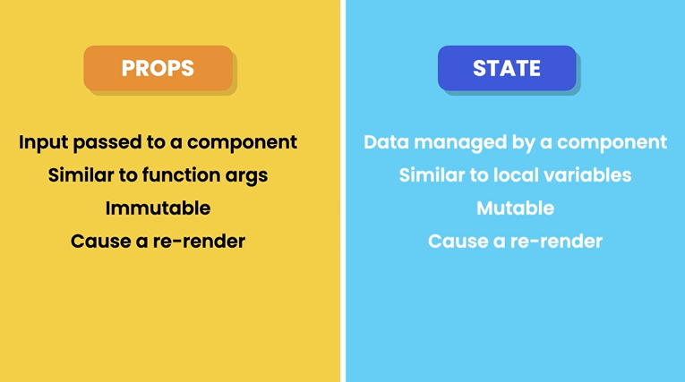
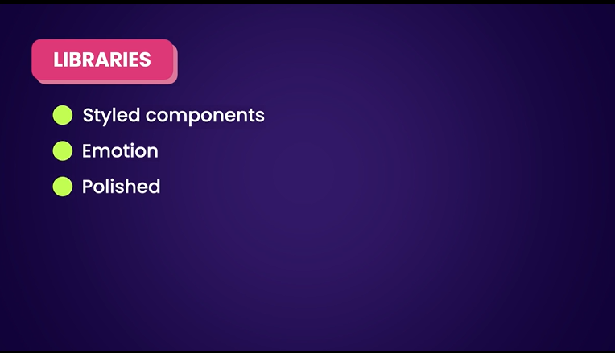

# Building Components (!important)


## Creating a listgroup components

1. Use bootstrap - import 'bootstrap/dist/css/bootstrap.css' in main.tsx file

2. Create component folder and put all components inside that folder

- ctrl + p in vscode to find files in explorer.
- class is a reserved keyword in Js or Ts,so we add className
- ctrl + D to select next occurence of the selected keyword
- format document to select prettier extension over default Js and Ts formatter.

## Fragments

- In react, a component cant return more than 1 element. If we want to add more,wrap into a div component


But this way we add unnecessary elements just to make react happy.

Another solution is by using fragments(Add empty angle bracket)

```
ListGroup.tsx

function ListGroup() {
  return (
    <>
      <h1>List</h1>
      <ul className="list-group">
        <li className="list-group-item">An item</li>
        <li className="list-group-item">A second item</li>
        <li className="list-group-item">A third item</li>
        <li className="list-group-item">A fourth item</li>
        <li className="list-group-item">And a fifth one</li>{" "}
      </ul>
    </>
  );
}
export default ListGroup;

```

## Rendering Lists

in react we dont have for loops

Use mapping array
In JSX inly allowed to use HTML or React component,so use { } to add Js syntax.

Warning on key prop.Should have key=value pair


```
ListGroup.tsx
function ListGroup() {
  const items = ["New York", "San Fransisco", "Tokyo", "London", "Paris"];

  return (
    <>
      <h1>List</h1>
      <ul className="list-group">
        {items.map((item) => (
          <li key={item}>{item}</li>
        ))}
      </ul>
    </>
  );
}

export default ListGroup;
```

## Conditional Rendering

1. This is one way,use if statements

```
ListGroup.tsx

function ListGroup() {
  let items = ["New York", "San Fransisco", "Tokyo", "London", "Paris"];
  items = [];

  if (items.length === 0)
    return (
      <>
        <h1> List</h1>
        <p>No Item Found</p>
      </>
    );

  return (
    <>
      <h1>List</h1>
      <ul className="list-group">
        {items.map((item) => (
          <li key={item}>{item}</li>
        ))}
      </ul>
    </>
  );
}

export default ListGroup;
```

2. Another way is by using JSX expression

```
ListGroup.tsx

function ListGroup() {
  let items = ["New York", "San Fransisco", "Tokyo", "London", "Paris"];
  items = [];

  return (
    <>
      <h1>List</h1>
      {items.length === 0 ? <p>No item found</p> : null}
      <ul className="list-group">
        {items.map((item) => (
          <li key={item}>{item}</li>
        ))}
      </ul>
    </>
  );
}

export default ListGroup;

// return (); is JSX expression
```

3. But sometimes this logic might pollute our JSX components, to solve that we extract the logic and put it in another variables or constant

```
ListGroup.tsx

function ListGroup() {
  let items = ["New York", "San Fransisco", "Tokyo", "London", "Paris"];
  items = [];

  const message = items.length === 0 ? <p>No item found</p> : null;

  return (
    <>
      <h1>List</h1>
      {message}
      <ul className="list-group">
        {items.map((item) => (
          <li key={item}>{item}</li>
        ))}
      </ul>
    </>
  );
}

export default ListGroup;

// return (); is JSX expression
```

4. Also can include inside a function and removed the const. benefits of using function is we can put parameter

```
ListGroup.tsx

function ListGroup() {
  let items = ["New York", "San Fransisco", "Tokyo", "London", "Paris"];
  items = [];

  const message = items.length === 0 ? <p>No item found</p> : null;

  return (
    <>
      <h1>List</h1>
      {message}
      <ul className="list-group">
        {items.map((item) => (
          <li key={item}>{item}</li>
        ))}
      </ul>
    </>
  );
}

export default ListGroup;

// return (); is JSX expression
```

5. More concise way to write the same code

```
ListGroup.tsx

      {items.length === 0 ? <p>No item found</p> : null}
      {items.length === 0 && <p>No item found</p>} //better syntax
```



- This one means that if the condition is true,the result of the entire expression will be printed. If false,all the entire expression will be false and nothing will be rendered in the screen.So by this way we dont have to include : null in our code.

Final implementation

```
ListGroup.tsx

function ListGroup() {
  let items = ["New York", "San Fransisco", "Tokyo", "London", "Paris"];
  items = [];

  return (
    <>
      <h1>List</h1>
      {items.length === 0 && <p>No item found</p>}
      <ul className="list-group">
        {items.map((item) => (
          <li key={item}>{item}</li>
        ))}
      </ul>
    </>
  );
}

export default ListGroup;

// return (); is JSX expression
```

## Handling Events

what happen when user click.

```
ListGroup.tsx

function ListGroup() {
  let items = ["New York", "San Fransisco", "Tokyo", "London", "Paris"];

  return (
    <>
      <h1>List</h1>
      {items.length === 0 && <p>No item found</p>}
      <ul className="list-group">
        {items.map((item) => (
          <li
            className="list-group-item"
            key={item}
            onClick={() => console.log("Clicked")}
          >
            {item}
          </li>
        ))}
      </ul>
    </>
  );
}

export default ListGroup;
```

Output:


by changing console.log('Clicked') to console.log(item the output would be like this)


We can also add event to onClick={(event) => console.log(event)}

Output:


Type Annotation in Ts

```
ListGroup.tsx

import { MouseEvent } from "react";

function ListGroup() {
  let items = ["New York", "San Fransisco", "Tokyo", "London", "Paris"];

  //Event Handler
  const handleClick = (event: MouseEvent) => console.log(event);

  return (
    <>
      <h1>List</h1>
      {items.length === 0 && <p>No item found</p>}
      <ul className="list-group">
        {items.map((item) => (
          <li className="list-group-item" key={item} onClick={handleClick}>
            {item}
          </li>
        ))}
      </ul>
    </>
  );
}

export default ListGroup;
```

## Managing State

When user click,we want to hightlight it.use bootstrap

```
ListGroup.tsx

import {useState } from "react";


function ListGroup() {
  let items = ["New York", "San Fransisco", "Tokyo", "London", "Paris"];

  //Hook is features allows us to tap in features that have been built in React
  const [selectedIndex, setSelectedIndex] = useState(-1);


  return (
    <>
      <h1>List</h1>
      {items.length === 0 && <p>No item found</p>}
      <ul className="list-group">
        {items.map((item, index) => (
          <li
            className={
              selectedIndex === index
                ? "list-group-item active"
                : "list-group-item"
            }
            key={item}
            onClick={() => {setSelectedIndex(index);}}
          >
            {item}
          </li>
        ))}
      </ul>
    </>
  );
}

export default ListGroup;
```

## Passing Data via Props

Now we want to make the components reusable.We want to use the same list but displaying another data like list of names. So we use props or properties.

```
ListGroup.tsx

import {useState } from "react";

// { items: [], heading: string} //interface is one of the Ts features
interface Props {
  items: string[]; //we define various properties and their types
  heading: string;
}

function ListGroup({items, heading}: Props) {

  //Hook is features allows us to tap in features that have been built in React
  const [selectedIndex, setSelectedIndex] = useState(-1);


  return (
    <>
      <h1>{heading}</h1>
      {items.length === 0 && <p>No item found</p>}
      <ul className="list-group">
        {items.map((item, index) => (
          <li
            className={
              selectedIndex === index
                ? "list-group-item active"
                : "list-group-item"
            }
            key={item}
            onClick={() => {setSelectedIndex(index);}}
          >
            {item}
          </li>
        ))}
      </ul>
    </>
  );
}

export default ListGroup;

```

```
App.tsx

import ListGroup from "./components/ListGroup"; //need to import first


function App() {
  let items = ["New York", "San Fransisco", "Tokyo", "London", "Paris"];

  return <div><ListGroup items={items} heading="Cities"/></div>
}

export default App;

```
## Passing Functions via Props

So something should happen when we click an item.

```
App.tsx

import ListGroup from "./components/ListGroup"; //need to import first

function App() {
  let items = ["New York", "San Fransisco", "Tokyo", "London", "Paris"];

  const handleSelectItem = (item: string) => {
    console.log(item);
  };

  return (
    <div>
      <ListGroup
        items={items}
        heading="Cities"
        onSelectItem={handleSelectItem}
      />
    </div>
  );
}

export default App;
```

```
ListGroup.tsx

import { useState } from "react";

// { items: [], heading: string}
interface Props {
  items: string[];
  heading: string;
  // (item: string) => void
  onSelectItem: (item: string) => void;
}

function ListGroup({ items, heading, onSelectItem }: Props) {
  //Hook is features allows us to tap in features that have been built in React
  const [selectedIndex, setSelectedIndex] = useState(-1);

  return (
    <>
      <h1>{heading}</h1>
      {items.length === 0 && <p>No item found</p>}
      <ul className="list-group">
        {items.map((item, index) => (
          <li
            className={
              selectedIndex === index
                ? "list-group-item active"
                : "list-group-item"
            }
            key={item}
            onClick={() => {
              setSelectedIndex(index);
              onSelectItem(item);
            }}
          >
            {item}
          </li>
        ))}
      </ul>
    </>
  );
}

export default ListGroup;
```

## State vs Props


## Passing Children

instead of defining function (){}

and export default; 

use **rafce** keyword to automatically generate function export syntax

```
Alert.tsx

import { ReactNode } from "react";

interface Props{
    children: ReactNode;
}

const Alert = ({children} : Props) => {
  return (
    <div className="alert alert-primary">{children}</div>
  )
}

export default Alert
```

```
App.tsx

import Alert from "./components/Alert";

function App() {
  return (
    <div>
      <Alert>
        Hello World
      </Alert>
    </div>
  );
}

export default App;
```
## Inspecting with React Dev Tools

## Exercise: Building a button component

Interface to make our components dynamic

1. Import the layout from bootstrap
2. make the button dynamic
3. handle the event

add ? to Props to tell Ts that the property is optional

```
Button.tsx

import { ReactNode } from "react";

interface Props{
    children: ReactNode;
    color?: 'primary' | 'secondary' | 'success'; // | is union operator
    onClick: () => void; 
}

const Button = ({children, onClick, color='primary'} : Props) => {
  return (
    <button className={"btn btn-" + color} onClick={onClick}>{children}</button>
  )
}

export default Button
```

```
App.tsx

import Button from "./components/Button";

function App() {
  return (
    <div>
      <Button  onClick={() => console.log('Clicked')}>
        Please Sign Up
      </Button>
    </div>
  );
}

export default App;

```

## Exercise: Showing an alert

```
Button.tsx

import { ReactNode } from "react";

interface Props{
    children: ReactNode;
    color?: 'primary' | 'secondary' | 'success'; // | is union operator
    onClick: () => void; 
}

const Button = ({children, onClick, color='primary'} : Props) => {
  return (
    <button className={"btn btn-" + color} onClick={onClick}>{children}</button>
  )
}

export default Button
```

```
Alert.tsx

import { ReactNode } from "react";

interface Props{
    children: ReactNode;
    onClose: () => void; //function with no parameter that return void
}

const Alert = ({children, onClose} : Props) => {
  return (
    <div 
    className="alert alert-primary alert-dismissible">{children}
    <button type="button" className="btn-close" onClick={onClose} data-bs-dismiss="alert" aria-label="Close"></button>
    
    </div>
  )
}

export default Alert
```

```
App.tsx

import { useState } from "react";
import Alert from "./components/Alert";
import Button from "./components/Button";

function App() {
  const [alertVisible, setAlertVisibility] = useState(false);

  return (
    <div>
      {alertVisible && <Alert onClose={() => setAlertVisibility(false)}>My Alert</Alert>}
      <Button onClick={() => setAlertVisibility(true)}>Please Sign Up</Button>
    </div>
  );
}

export default App;
```


