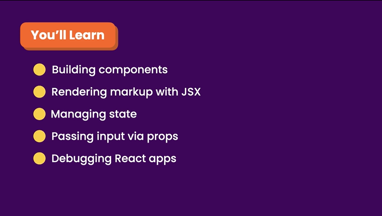
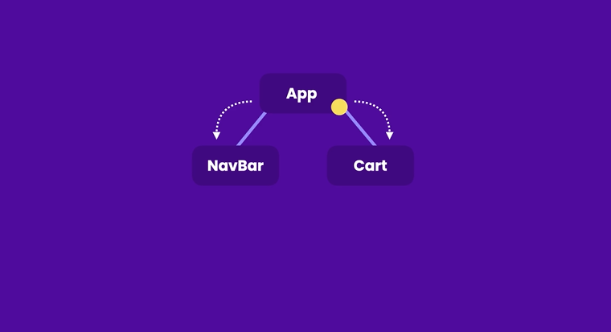
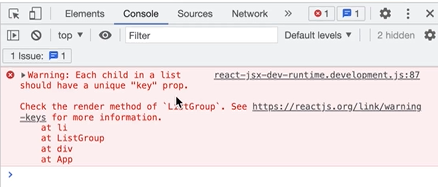
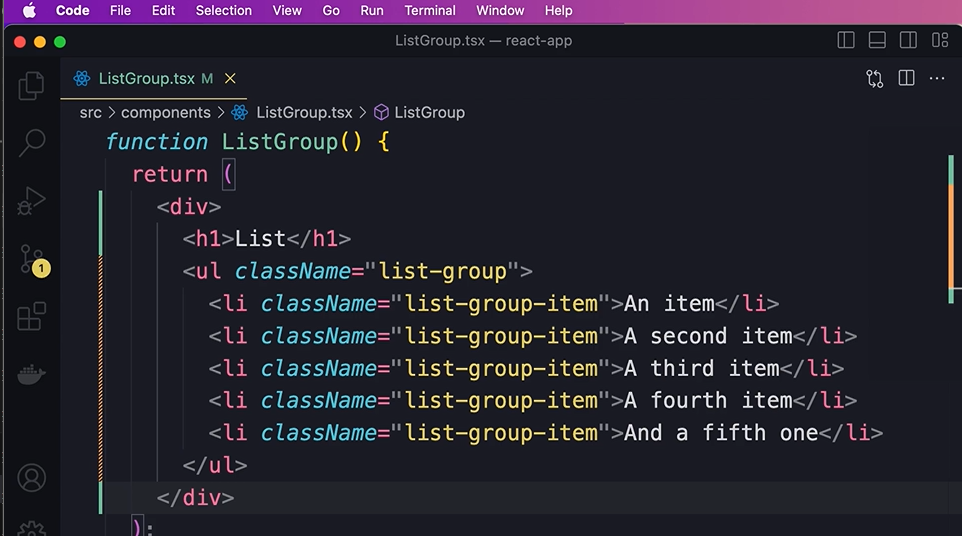
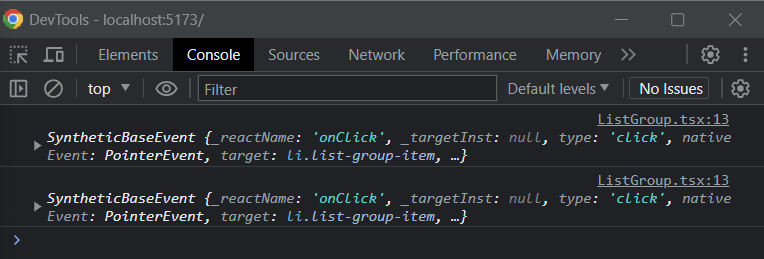
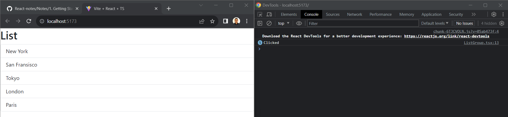
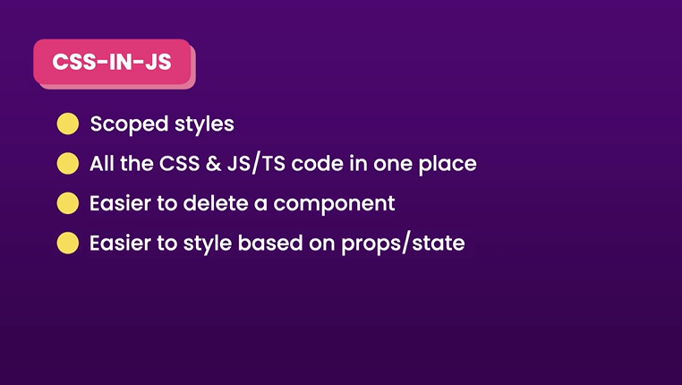
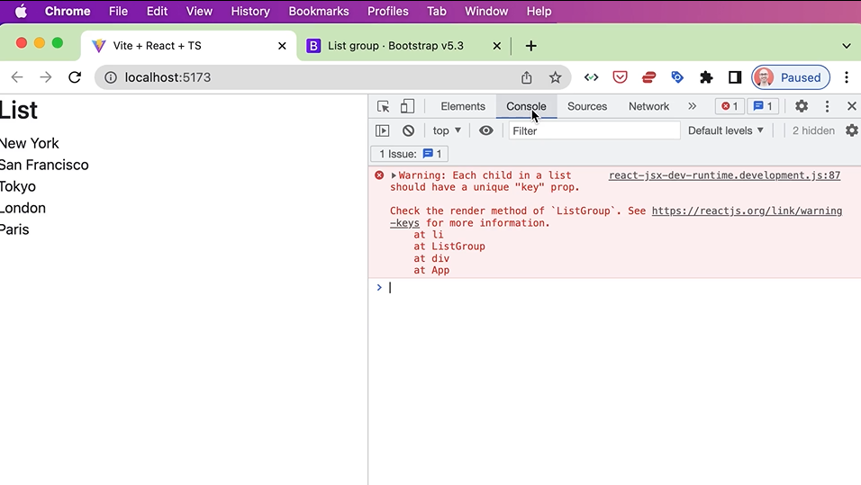
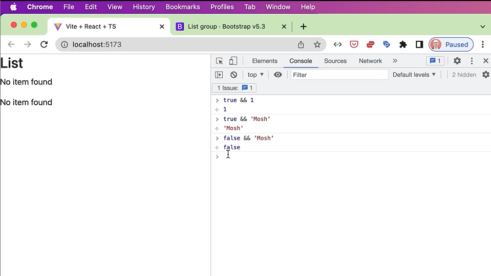
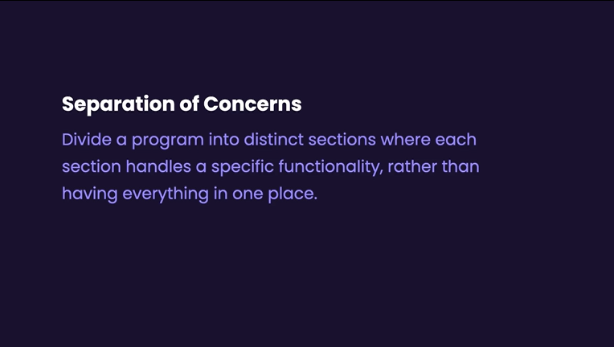

# Building Components (important)



## Creating a listgroup components

- Install Bootstrap
- Import it into main.tsx file at the top.
- Create components folder and put all components in it. (components such as NavBar,SideBar,MainPage)
- File name is in PascalNamingConvention
- Define a function, give it a name and export it
  
- Then in App.tsx app component, we import it.
- Press **ctrl + p** in vscode to find files in explorer.
- Copy ListGroup code from Bootstrap and paste it in ListGroup component.
- class is a reserved keyword in Js or Ts,so we add className
- Press **ctrl + D** to select next occurance of the selected keyword

## Fragments

- In react, a component can't return more than 1 element. If we want to add more element, wrap into a div component.(<#h1> is 1 element, <#ul> is another element)



- But this way we add unnecessary elements just to make react happy.

- Another solution is by using fragments(Add empty angle bracket).

- (Gantikan <#div> dengan <>)

```
ListGroup.tsx

function ListGroup() {
  return (
    <>
      <h1>List</h1>
      <ul className="list-group">
        <li className="list-group-item">An item</li>
        <li className="list-group-item">A second item</li>
        <li className="list-group-item">A third item</li>
        <li className="list-group-item">A fourth item</li>
        <li className="list-group-item">And a fifth one</li>{" "}
      </ul>
    </>
  );
}
export default ListGroup;

```

## Rendering Lists



- List ni uselesss sebab kita hardcode dekat markup. So macam mana nak render list ni dynamically?

- Tambah array list of items.

- in react we don't have for loops. So we use mapping array.

- So we type and pass arrow function says take each item and convert it to an item of different type.

- Kita nak take each item then convert to <#li> element

- In JSX markup only allowed to use HTML or React component,so use { } to add Js syntax.

```
items.map (item => <li>{item}</li>)
```

Warning on key prop. Should have key=value pair sebab bila ada changes dan tak letak key, React tak tau nak trace key-id mana nak ubah.


```
ListGroup.tsx
function ListGroup() {
  const items = ["New York", "San Fransisco", "Tokyo", "London", "Paris"];

  return (
    <>
      <h1>List</h1>
      <ul className="list-group">
        {items.map((item) => (
          <li key={item}>{item}</li>
        ))}
      </ul>
    </>
  );
}

export default ListGroup;
```

## Conditional Rendering

- sometimes we render a component based on certain conditions.

- This is one way, we use if statements, but occasionally it will create duplication in our code. In this code we duplicate the header <#h1> List<#/h1>

```
ListGroup.tsx

function ListGroup() {
  let items = ["New York", "San Fransisco", "Tokyo", "London", "Paris"];
  items = [];

  if (items.length === 0)
    return (
      <>
        <h1> List</h1>
        <p>No Item Found</p>
      </>
    );

  return (
    <>
      <h1>List</h1>
      <ul className="list-group">
        {items.map((item) => (
          <li key={item}>{item}</li>
        ))}
      </ul>
    </>
  );
}

export default ListGroup;
```

- Another way is render dynamically inside JSX expression.

```
ListGroup.tsx

function ListGroup() {
  let items = ["New York", "San Fransisco", "Tokyo", "London", "Paris"];
  items = [];

  return (
    <>
      <h1>List</h1>
      {items.length === 0 ? <p>No item found</p> : null}
      <ul className="list-group">
        {items.map((item) => (
          <li key={item}>{item}</li>
        ))}
      </ul>
    </>
  );
}

export default ListGroup;

// return (); is the JSX expression
```

- But sometimes this logic might pollute our JSX components, to solve that we extract the logic and put it in another variables or constant.

```
ListGroup.tsx

function ListGroup() {
  let items = ["New York", "San Fransisco", "Tokyo", "London", "Paris"];
  items = [];

  const message = items.length === 0 ? <p>No item found</p> : null;

  return (
    <>
      <h1>List</h1>
      {message}
      <ul className="list-group">
        {items.map((item) => (
          <li key={item}>{item}</li>
        ))}
      </ul>
    </>
  );
}

export default ListGroup;

// return (); is JSX expression
```

- Also can include inside a function and removed the const. benefits of using function is we can put parameter.

```
ListGroup.tsx

function ListGroup() {
  let items = ["New York", "San Fransisco", "Tokyo", "London", "Paris"];
  items = [];

  const getMessage = () => {
    return items.length === 0 ? <p>No item found</p> : null;
  } 

  return (
    <>
      <h1>List</h1>
      {getMessage()}
      <ul className="list-group">
        {items.map((item) => (
          <li key={item}>{item}</li>
        ))}
      </ul>
    </>
  );
}

export default ListGroup;

// return (); is JSX expression
```

- More concise way to write the same code

```
ListGroup.tsx

      {items.length === 0 ? <p>No item found</p> : null}
      {items.length === 0 && <p>No item found</p>} //use logical AND for a better syntax
```



- This one means that if the condition is true,the result of the entire expression will be printed. If false,all the entire expression will be false and nothing will be rendered in the screen. So by this way we dont have to include : null in our code.

Final implementation

```
ListGroup.tsx

function ListGroup() {
  let items = ["New York", "San Fransisco", "Tokyo", "London", "Paris"];

  return (
    <>
      <h1>List</h1>
      {items.length === 0 && <p>No item found</p>}
      <ul className="list-group">
        {items.map((item) => (
          <li key={item}>{item}</li>
        ))}
      </ul>
    </>
  );
}

export default ListGroup;

// return (); is JSX expression
```

```
ChatGPT

function ListGroup() {
  const cities = ["New York", "San Francisco", "Tokyo", "London", "Paris"];

  return (
    <>
      <h1>List</h1>
      {cities.length === 0 && <p>No item found</p>}
      <ul className="list-group">
        {cities.map((city) => (
          <li key={city}>{city}</li>
        ))}
      </ul>
    </>
  );
}

export default ListGroup;

Q : here is how i read 

{cities.map((city) => (<li key={city}>{city}</li>))}

map the array in cities array and put it into city variables, convert it to a list of city that contains the key from city.am i right?

A : Yes, you are absolutely right! Your interpretation of `{cities.map((city) => (<li key={city}>{city}</li>))}` is spot on.

Here's a breakdown of how your interpretation aligns with the code:

`cities.map((city) => ...)` iterates over each element in the `cities` array, and for each element (which represents a city in this case), it performs the following:

`<li key={city}>{city}</li>` creates a list item (`<li>`) element for each city, where:
`key={city}` uniquely identifies each list item by using the city's name as the key.
`{city}` displays the name of the city as the content of the list item.

So, you're correctly mapping the `cities` array to a list of city elements, with each city having its own key and name displayed in the list. This is a common pattern in React for rendering lists of data.
```

## Handling Events

* what happen when user click.
* In react, each element has a property called onClick.

```
onClick {}
inside braces we can write an arrow function.
So a function with no parameter.
onClick={() => console.log("Clicked")}
```
```
ListGroup.tsx

function ListGroup() {
  let items = ["New York", "San Fransisco", "Tokyo", "London", "Paris"];

  return (
    <>
      <h1>List</h1>
      {items.length === 0 && <p>No item found</p>}
      <ul className="list-group">
        {items.map((item) => (
          <li
            className="list-group-item"
            key={item}
            onClick={() => console.log("Clicked")}
          >
            {item}
          </li>
        ))}
      </ul>
    </>
  );
}

export default ListGroup;
```
Output:


* by changing console.log('Clicked') to console.log(item) the output would be like this


* We can also add index to it
```
{items.map((item, index) => (
  <li
      className="list-group-item"
      key={item}
      onClick={() => console.log(item, index)}
  >
      {item}
  </li>
))}
```
* onClick arrow function can optionally have a parameter that represents the browser events. 


```
(event: MouseEvent)
```

This is called type Annotation in Ts. So with type annotation, we can specify the type of our variables, parameters and so on. 
```
ListGroup.tsx

import { MouseEvent } from "react";

function ListGroup() {
  let items = ["New York", "San Fransisco", "Tokyo", "London", "Paris"];

  //Event Handler
  const handleClick = (event: MouseEvent) => console.log(event);

  return (
    <>
      <h1>List</h1>
      {items.length === 0 && <p>No item found</p>}
      <ul className="list-group">
        {items.map((item) => (
          <li className="list-group-item" key={item} onClick={handleClick}>
            {item}
          </li>
        ))}
      </ul>
    </>
  );
}

export default ListGroup;
```
## Managing State

* When user click,we want to hightlight it. We add active to the li class 
```
<li className="list-group-item active" key={item} onClick={handleClick}>
  {item}
</li>
```
* Tapi macam ni akan highlight semua list.
* Untuk hightlight 1 list at a time, we need a variable to keep track of the index of the selected item. 
* declare variable called selectedIndex and initialize it to 0
```
function ListGroup() {
  let items = ["New York", "San Fransisco", "Tokyo", "London", "Paris"];
  let selectedIndex = 0;
}
```
* Then, render active class dekat ```li``` element dynamically.
```
<li className={selectedIndex === index ? "list-group-item active" : "list-group-item" } 
            
key={item} 
onClick={handleClick}>{item}
</li>
```
* So sekarang, kita nak hightlight based on item yang kita select. So kena remove eventHandler sebab harcode. And we use simple arrow function

```
function ListGroup() {
  let items = ["New York", "San Fransisco", "Tokyo", "London", "Paris"];
  let selectedIndex = 0;
  
  return (
    <>
      <h1>List</h1>
      {items.length === 0 && <p>No item found</p>}
      <ul className="list-group">
        {items.map((item, index) => (
          <li className={selectedIndex === index ? "list-group-item active" : "list-group-item" } 
            key={item} 
            onClick={() => {selectedIndex = index;}}>
            {item}
          </li>
        ))}
      </ul>
    </>
  );
}
```
* Tapi tak jadi sebab variables declared ```let selectedIndex = 0``` is local to the function component, so React is not aware of it. To solve this, we should tell React that this component is going to have data or state that might change overtime and to do that we will use the build in function in React called useState.

useState is hook. A hook is a function that allows us to tap into build in features in React. useState is called state hook. 

So instead of declaring variable this way ```let selectedIndex = 0```, we call this useState function,initialize to -1 and this would return an array.
```
const arr = useState = (-1)
arr [0] //variable (selectedIndex)
arr[1] //updater function
```
* In this arr, we going to have 2 elements, first is variable such as selectedIndex variables, while the second element would be an updater function. using updater function we can update the variable and React will be notified and knows our component has changed and will updated it in DOM.
```
const [selectedIndex, setSelectedIndex] = useState(-1);
```
* Each group has its own state
```
ListGroup.tsx

import {useState } from "react";


function ListGroup() {
  let items = ["New York", "San Fransisco", "Tokyo", "London", "Paris"];

  //Hook is features allows us to tap in features that have been built in React
  const [selectedIndex, setSelectedIndex] = useState(-1);


  return (
    <>
      <h1>List</h1>
      {items.length === 0 && <p>No item found</p>}
      <ul className="list-group">
        {items.map((item, index) => (
          <li
            className={
              selectedIndex === index
                ? "list-group-item active"
                : "list-group-item"
            }
            key={item}
            onClick={() => {setSelectedIndex(index);}}
          >
            {item}
          </li>
        ))}
      </ul>
    </>
  );
}

export default ListGroup;
```
## Passing Data via Props

Now we want to make the components reusable. We want to use the same list but displaying another data like list of names, or a list of colors. So we use props or properties. Props are the input for our component. 

* First need to define the shape of that component.
* Need to pass an object with 2 properties, items and heading (string)
``` {items: [], heading: string}``` so we use one of the build in features in Ts that is interface.
* Props are the input for our component. Instead of defining that items in the component, we should be able to pass them as the input to the component. Just like we call a function and give an argument.
```
ListGroup.tsx

import {useState } from "react";

// { items: [], heading: string} //interface is one of the Ts features
interface Props {
  items: string[]; //we define various properties and their types
  heading: string;
}

function ListGroup({items, heading}: Props) {

  //Hook is features allows us to tap in features that have been built in React
  const [selectedIndex, setSelectedIndex] = useState(-1);


  return (
    <>
      <h1>{heading}</h1>
      {items.length === 0 && <p>No item found</p>}
      <ul className="list-group">
        {items.map((item, index) => (
          <li
            className={
              selectedIndex === index
                ? "list-group-item active"
                : "list-group-item"
            }
            key={item}
            onClick={() => {setSelectedIndex(index);}}
          >
            {item}
          </li>
        ))}
      </ul>
    </>
  );
}

export default ListGroup;

```

```
App.tsx

import ListGroup from "./components/ListGroup"; //need to import first


function App() {
  let items = ["New York", "San Fransisco", "Tokyo", "London", "Paris"];

  return <div><ListGroup items={items} heading="Cities"/></div>
}

export default App;

```
## Passing Functions via Props

Now we can select an item. So something should happen when we click an item like filter a list of object, navigate to another page.

```
App.tsx

import ListGroup from "./components/ListGroup"; //need to import first

function App() {
  let items = ["New York", "San Fransisco", "Tokyo", "London", "Paris"];

  const handleSelectItem = (item: string) => {
    console.log(item);
  };

  return (
    <div>
      <ListGroup
        items={items}
        heading="Cities"
        onSelectItem={handleSelectItem}
      />
    </div>
  );
}

export default App;
```

```
ListGroup.tsx

import { useState } from "react";

// { items: [], heading: string}
interface Props {
  items: string[];
  heading: string;
  // (item: string) => void
  onSelectItem: (item: string) => void; //the type of this property is a function that has a type parameter of string and returns void.
}

function ListGroup({ items, heading, onSelectItem }: Props) {
  //Hook is features allows us to tap in features that have been built in React
  const [selectedIndex, setSelectedIndex] = useState(-1);

  return (
    <>
      <h1>{heading}</h1>
      {items.length === 0 && <p>No item found</p>}
      <ul className="list-group">
        {items.map((item, index) => (
          <li
            className={
              selectedIndex === index
                ? "list-group-item active"
                : "list-group-item"
            }
            key={item}
            onClick={() => {
              setSelectedIndex(index);
              onSelectItem(item);
            }}
          >
            {item}
          </li>
        ))}
      </ul>
    </>
  );
}

export default ListGroup;
```

## State vs Props



## Passing Children

instead of defining function ( ){ }

and export default;

use **rafce** keyword to automatically generate function export syntax

```
Alert.tsx

import { ReactNode } from "react";

interface Props{
    children: ReactNode;
}

const Alert = ({children} : Props) => {
  return (
    <div className="alert alert-primary">{children}</div>
  )
}

export default Alert
```

```
App.tsx

import Alert from "./components/Alert";

function App() {
  return (
    <div>
      <Alert>
        Hello World
      </Alert>
    </div>
  );
}

export default App;
```

## Inspecting with React Dev Tools

## Exercise: Building a button component

Interface to make our components dynamic

1. Import the layout from bootstrap
2. make the button dynamic
3. handle the event

add ? to Props to tell Ts that the property is optional

```
Button.tsx

import { ReactNode } from "react";

interface Props{
    children: ReactNode;
    color?: 'primary' | 'secondary' | 'success'; // | is union operator
    onClick: () => void;
}

const Button = ({children, onClick, color='primary'} : Props) => {
  return (
    <button className={"btn btn-" + color} onClick={onClick}>{children}</button>
  )
}

export default Button
```

```
App.tsx

import Button from "./components/Button";

function App() {
  return (
    <div>
      <Button  onClick={() => console.log('Clicked')}>
        Please Sign Up
      </Button>
    </div>
  );
}

export default App;

```

## Exercise: Showing an alert

```
Button.tsx

import { ReactNode } from "react";

interface Props{
    children: ReactNode;
    color?: 'primary' | 'secondary' | 'success'; // | is union operator
    onClick: () => void;
}

const Button = ({children, onClick, color='primary'} : Props) => {
  return (
    <button className={"btn btn-" + color} onClick={onClick}>{children}</button>
  )
}

export default Button
```

```
Alert.tsx

import { ReactNode } from "react";

interface Props{
    children: ReactNode;
    onClose: () => void; //function with no parameter that return void
}

const Alert = ({children, onClose} : Props) => {
  return (
    <div
    className="alert alert-primary alert-dismissible">{children}
    <button type="button" className="btn-close" onClick={onClose} data-bs-dismiss="alert" aria-label="Close"></button>

    </div>
  )
}

export default Alert
```

```
App.tsx

import { useState } from "react";
import Alert from "./components/Alert";
import Button from "./components/Button";

function App() {
  const [alertVisible, setAlertVisibility] = useState(false);

  return (
    <div>
      {alertVisible && <Alert onClose={() => setAlertVisibility(false)}>My Alert</Alert>}
      <Button onClick={() => setAlertVisibility(true)}>Please Sign Up</Button>
    </div>
  );
}

export default App;
```
