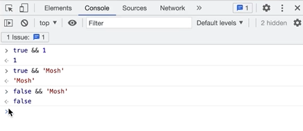

# **Building Components (IMPORTANT)**


## **Creating a ListGroup Components**

- Install Bootstrap.
- Import Bootstrap into main.tsx file at the top.
- Create components folder and put all components in it. (example of components such as NavBar, SideBar, MainPage)
- Components file name is in PascalNamingConvention.
- Define a function, give it a name and export it.

```
//This function is named ListGroup
//Contains h1 element and we export the component

function ListGroup () {
    return <h1>List Group</h1>
}

export default ListGroup;
```

- Then in App.tsx app component, we import it.

```
//First import from ListGroup component
//Then call it in JSX markup

import ListGroup from "./components/ListGroup";

function App() {
  return <div>
    <ListGroup/>
  </div>
}

export default App;
```

- Press **ctrl + p** in vscode to find files in explorer.
- Press **ctrl + tab** to switch between files.
- Add list of items in ListGroup component.
- Copy ListGroup code from Bootstrap and paste it in ListGroup.tsx component.

```
function ListGroup() {
  return (
    <ul className="list-group">
      <li className="list-group-item">An item</li>
      <li className="list-group-item">A second item</li>
      <li className="list-group-item">A third item</li>
      <li className="list-group-item">A fourth item</li>
      <li className="list-group-item">And a fifth one</li>
    </ul>
  );
}

export default ListGroup;
```

- Class is a reserved keyword in Js or Ts,so we add className to define the class in Js or Ts.
- Press **ctrl + D** to select next occurance of the selected keyword.

## **Fragments**

- In react, a component can't return more than 1 element. If we want to add more element, we wrap into a div component.(`<h1>` is 1 element, `<ul>` is the second element)
- But this way we add unnecessary elements just to make React happy.
- Another solution is by using fragments(Add empty angle bracket).
- Replace `<div>`dengan `< >`

```
function ListGroup() {
  return (
    <>
      <h1>List</h1>
      <ul className="list-group">
        <li className="list-group-item">An item</li>
        <li className="list-group-item">A second item</li>
        <li className="list-group-item">A third item</li>
        <li className="list-group-item">A fourth item</li>
        <li className="list-group-item">And a fifth one</li>
      </ul>
    </>
  );
}

export default ListGroup;
```

## **Rendering Lists**

- Current ListGroup.tsx ni uselesss sebab kita hardcode dekat markup. So macam mana nak render list ni dynamically?
- Tambah array list of items.

```
function ListGroup() {
  const items = ["New York", "San Francisco", "Tokyo", "London", "Paris"];

  return (
    <>
      <h1>List</h1>
      <ul className="list-group">
        <li className="list-group-item">An item</li>
        <li className="list-group-item">A second item</li>
        <li className="list-group-item">A third item</li>
        <li className="list-group-item">A fourth item</li>
        <li className="list-group-item">And a fifth one</li>
      </ul>
    </>
  );
}

export default ListGroup;
```

- in react we don't have for loops. So we use mapping array.
- So we type and pass arrow function says take each item and convert it to `<li>` element

```
function ListGroup() {
  const items = ["New York", "San Francisco", "Tokyo", "London", "Paris"];

  return (
    <>
      <h1>List</h1>
      <ul className="list-group">
        {items.map((item) => (
          <li>{item}</li>
        ))}
      </ul>
    </>
  );
}

export default ListGroup;
```

- In JSX markup only allowed to use HTML or React component,so add `{ }` to add Js syntax dynamically.

`{items.map((item) => (<li>{item}</li>))}`

- Warning on key prop.


- The warning indicates that each list item should have key properties that uniquely identifies that item. React need this to keep track of our item. So later when we add or remove item dynamically, React knows what part of the page should be updated. So when rendering a list of item using map method, we should give each item a unique key.

```
function ListGroup() {
  const items = ["New York", "San Francisco", "Tokyo", "London", "Paris"];

  return (
    <>
      <h1>List</h1>
      <ul className="list-group">
        {items.map((item) => (
          <li key={item}>{item}</li>
        ))}
      </ul>
    </>
  );
}

export default ListGroup;
```

## **Conditional Rendering**

- Sometimes we want to render different content based on certain conditions.

- This is one way, we use if statements, but occasionally it will create duplication in our code. In this code we duplicate the header `<h1>List</h1>`

```
function ListGroup() {
  let items = ["New York", "San Francisco", "Tokyo", "London", "Paris"];
  items = [];

  if (items.length === 0)
    return (
      <>
        <h1>List</h1>
        <p>No item found</p>
      </>
    );

  return (
    <>
      <h1>List</h1>
      <ul className="list-group">
        {items.map((item) => (
          <li key={item}>{item}</li>
        ))}
      </ul>
    </>
  );
}

export default ListGroup;
```

- Another way is render dynamically inside JSX expression.

```
ListGroup.tsx

function ListGroup() {
  let items = ["New York", "San Fransisco", "Tokyo", "London", "Paris"];
  items = [];

  return (
    <>
      <h1>List</h1>
      {items.length === 0 ? <p>No item found</p> : null}
      <ul className="list-group">
        {items.map((item) => (
          <li key={item}>{item}</li>
        ))}
      </ul>
    </>
  );
}

export default ListGroup;

// return (); is the JSX expression
```

- But sometimes this logic might pollute our JSX components, to solve that we extract the logic and put it in another variables or constant.

```
ListGroup.tsx

function ListGroup() {
  let items = ["New York", "San Fransisco", "Tokyo", "London", "Paris"];
  items = [];

  const message = items.length === 0 ? <p>No item found</p> : null;

  return (
    <>
      <h1>List</h1>
      {message}
      <ul className="list-group">
        {items.map((item) => (
          <li key={item}>{item}</li>
        ))}
      </ul>
    </>
  );
}

export default ListGroup;

// return (); is JSX expression
```

- Also can include inside a function and removed the constant. Benefits of using function is we can put parameter.

```
ListGroup.tsx

function ListGroup() {
  let items = ["New York", "San Fransisco", "Tokyo", "London", "Paris"];
  items = [];

  const getMessage = () => {
    return items.length === 0 ? <p>No item found</p> : null;
  }

  return (
    <>
      <h1>List</h1>
      {getMessage()}
      <ul className="list-group">
        {items.map((item) => (
          <li key={item}>{item}</li>
        ))}
      </ul>
    </>
  );
}

export default ListGroup;

// return (); is JSX expression
```

- More concise way to write the same code

```
ListGroup.tsx

      //Before
      {items.length === 0 ? <p>No item found</p> : null}

      //After
      {items.length === 0 && <p>No item found</p>} //use logical AND for a better syntax
```

- This one means that if the condition is true,the result of the entire expression will be printed. If false,all the entire expression will be false and nothing will be rendered in the screen. So by this way we dont have to include ``: null` in our code.
  

- Final implementation

```
ListGroup.tsx

function ListGroup() {
  let items = ["New York", "San Fransisco", "Tokyo", "London", "Paris"];

  return (
    <>
      <h1>List</h1>
      {items.length === 0 && <p>No item found</p>}
      <ul className="list-group">
        {items.map((item) => (
          <li key={item}>{item}</li>
        ))}
      </ul>
    </>
  );
}

export default ListGroup;

// return (); is JSX expression
```

```
ChatGPT

function ListGroup() {
  const cities = ["New York", "San Francisco", "Tokyo", "London", "Paris"];

  return (
    <>
      <h1>List</h1>
      {cities.length === 0 && <p>No item found</p>}
      <ul className="list-group">
        {cities.map((city) => (
          <li key={city}>{city}</li>
        ))}
      </ul>
    </>
  );
}

export default ListGroup;

Q : here is how i read

{cities.map((city) => (<li key={city}>{city}</li>))}

map the array in cities array and put it into city variables, convert it to a list of city that contains the key from city.am i right?

A : Yes, you are absolutely right! Your interpretation of `{cities.map((city) => (<li key={city}>{city}</li>))}` is spot on.

Here's a breakdown of how your interpretation aligns with the code:

1. cities.map((city) => ...)` iterates over each element in the `cities` array, and for each element (which represents a city in this case), it performs the following:

2. <li key={city}>{city}</li>` creates a list item (`<li>`) element for each city, where:
`key={city}` uniquely identifies each list item by using the city's name as the key.
`{city}` displays the name of the city as the content of the list item.

So, you're correctly mapping the `cities` array to a list of city elements, with each city having its own key and name displayed in the list. This is a common pattern in React for rendering lists of data.
```

## **Handling Events**

- Now we want to be able to click on the item and see it on the console.
- In react, each element has a property or prop called `onClick`.
- In the curly braces, we can write an arrow function and put a function with no parameters and can just display `Clicked` on the console.

```
function ListGroup() {
  let items = ["New York", "San Francisco", "Tokyo", "London", "Paris"];

  return (
    <>
      <h1>List</h1>
      {items.length === 0 && <p>No Item Found</p>}
      <ul className="list-group">
        {items.map((item) => (
          <li
            className="list-group-item"
            key={item}
            onClick={() => console.log("Clicked")}
          >
            {item}
          </li>
        ))}
      </ul>
    </>
  );
}

export default ListGroup;
```

- What if we want to see the actual item that was clicked?
- When mapping an array, we can also include index as the second paramater.

```
function ListGroup() {
  let items = ["New York", "San Francisco", "Tokyo", "London", "Paris"];

  return (
    <>
      <h1>List</h1>
      {items.length === 0 && <p>No Item Found</p>}
      <ul className="list-group">
        {items.map((item, index) => (
          <li
            className="list-group-item"
            key={item}
            onClick={() => console.log(item, index)}
          >
            {item}
          </li>
        ))}
      </ul>
    </>
  );
}

export default ListGroup;
```

- This arrow function inside onCLick can have optional parameter that represents the browser event.

```
function ListGroup() {
  let items = ["New York", "San Francisco", "Tokyo", "London", "Paris"];

  return (
    <>
      <h1>List</h1>
      {items.length === 0 && <p>No Item Found</p>}
      <ul className="list-group">
        {items.map((item, index) => (
          <li
            className="list-group-item"
            key={item}
            onClick={(event) => console.log(event)}
          >
            {item}
          </li>
        ))}
      </ul>
    </>
  );
}

export default ListGroup;
```


- Creating handleClick
- We use type annotation in Ts. We can specify the type of our variable, parameters and so on.

```
import { MouseEvent } from "react";

function ListGroup() {
  let items = ["New York", "San Francisco", "Tokyo", "London", "Paris"];

  //Event Handler
  const handleClick = (event: MouseEvent) => console.log(event);
  return (
    <>
      <h1>List</h1>
      {items.length === 0 && <p>No Item Found</p>}
      <ul className="list-group">
        {items.map((item, index) => (
          <li className="list-group-item" key={item} onClick={handleClick}>
            {item}
          </li>
        ))}
      </ul>
    </>
  );
}

export default ListGroup;
```

## **Managing State**

- When we click on an item, we want to hightlight it. We add `active` to the li class

```
<li className="list-group-item active" key={item} onClick={handleClick}>
  {item}
</li>
```

- Tapi macam ni akan highlight semua list.
- Untuk hightlight 1 list at a time, we need a variable to keep track of the index of the selected item.
- declare variable called selectedIndex and initialize it to 0

```
function ListGroup() {
  let items = ["New York", "San Fransisco", "Tokyo", "London", "Paris"];
  let selectedIndex = 0;
}
```

- Then, render active class dekat `li` element dynamically.

```
<li className={selectedIndex === index ? "list-group-item active" : "list-group-item" }

key={item}
onClick={handleClick}>{item}
</li>
```

- So sekarang, kita nak hightlight based on item yang kita select. So kena remove eventHandler sebab harcode. And we use simple arrow function.

```
function ListGroup() {
  let items = ["New York", "San Fransisco", "Tokyo", "London", "Paris"];
  let selectedIndex = 0;

  return (
    <>
      <h1>List</h1>
      {items.length === 0 && <p>No item found</p>}
      <ul className="list-group">
        {items.map((item, index) => (
          <li className={selectedIndex === index ? "list-group-item active" : "list-group-item" }
            key={item}
            onClick={() => {selectedIndex = index;}}>
            {item}
          </li>
        ))}
      </ul>
    </>
  );
}
```

- Tapi tak jadi sebab variables declared `let selectedIndex = 0` is local to the function component, so React is not aware of it. To solve this, we should tell React that this component is going to have data or state that might change over time and to do that we will use the build in function in React called useState.

- useState is hook. A hook is a function that allows us to tap into build in features in React. useState is called state hook.

- So instead of declaring variable this way `let selectedIndex = 0`, we call this `useState` function,initialize to -1 and this would return an array.

```
const arr = useState = (-1)
arr [0] //variable (selectedIndex)
arr[1] //updater function
```

- In this array, we're going to have 2 elements, first is variable such as selectedIndex variables, while the second element would be an updater function. using updater function we can update the variable and React will be notified and knows our component has changed and will updated it in DOM.

```
const [selectedIndex, setSelectedIndex] = useState(-1);
```

- Each group has its own state

```
ListGroup.tsx

import {useState } from "react";


function ListGroup() {
  let items = ["New York", "San Fransisco", "Tokyo", "London", "Paris"];

  //Hook is features allows us to tap in features that have been built in React
  const [selectedIndex, setSelectedIndex] = useState(-1);


  return (
    <>
      <h1>List</h1>
      {items.length === 0 && <p>No item found</p>}
      <ul className="list-group">
        {items.map((item, index) => (
          <li
            className={
              selectedIndex === index
                ? "list-group-item active"
                : "list-group-item"
            }
            key={item}
            onClick={() => {setSelectedIndex(index);}}
          >
            {item}
          </li>
        ))}
      </ul>
    </>
  );
}

export default ListGroup;
```

## Passing Data via Props

- Now we want to make the components reusable. We want to use the same list but displaying another data like list of names, or a list of colors. So we use props or properties. Props are the input for our component.

- First need to define the shape of that component. We will use `interface`, one of the build in function in React.
- Need to pass an object with 2 properties, items and heading (string)

```
interface Props {
  items: string[];
  heading: string[];
}
```

- body dalam interface ni yang akan kena declare dalam JSX element dalam App.tsx component.
- Props are the input for our component. Instead of defining that items in the component, we should be able to pass them as the input to the component. Just like we call a function and give an argument.

```
ListGroup.tsx

import {useState } from "react";

interface Props {
  items: string[];
  heading: string;
}

function ListGroup(props: Props) {

  const [selectedIndex, setSelectedIndex] = useState(-1);

  return (
    <>
      <h1>{heading}</h1>
      {items.length === 0 && <p>No item found</p>}
      <ul className="list-group">
        {items.map((item, index) => (
          <li
            className={
              selectedIndex === index
                ? "list-group-item active"
                : "list-group-item"
            }
            key={item}
            onClick={() => {setSelectedIndex(index);}}
          >
            {item}
          </li>
        ))}
      </ul>
    </>
  );
}

export default ListGroup;

```

- Kalau guna syntax `function ListGroup(props: Props) {}` akan keluar error sebab dalam function dah takda items variable dan kena fix dengan `props.items.length`
- So kita akan define `items,heading` dalam function ListGroup. `function ListGroup({ items, heading }: Props) {}`

```
import { useState } from "react";

interface Props {
  items: string[];
  heading: string;
}

function ListGroup({ items, heading }: Props) {
  const [selectedIndex, setSelectedIndex] = useState(-1);

  return (
    <>
      <h1>{heading}</h1>
      {items.length === 0 && <p>No item found</p>}
      <ul className="list-group">
        {items.map((item, index) => (
          <li
            className={
              selectedIndex === index
                ? "list-group-item active"
                : "list-group-item"
            }
            key={item}
            onClick={() => {
              setSelectedIndex(index);
            }}
          >
            {item}
          </li>
        ))}
      </ul>
    </>
  );
}

export default ListGroup;
```

```
import ListGroup from "./components/ListGroup";

function App() {
  let items = ["New York", "San Francisco", "Tokyo", "London", "Paris"];

  return (
    <div>
      <ListGroup items={items} heading="Cities" />
    </div>
  );
}

export default App;
```

## Passing Functions via Props

- Now we can select an item.
- So something should happen when we click an item like filter a list of object, navigate to another page.
- Add function `( )` dekat interface je

```
App.tsx

import ListGroup from "./components/ListGroup"; //need to import first

function App() {
  let items = ["New York", "San Fransisco", "Tokyo", "London", "Paris"];

  const handleSelectItem = (item: string) => {
    console.log(item);
  };

  return (
    <div>
      <ListGroup
        items={items}
        heading="Cities"
        onSelectItem={handleSelectItem}
      />
    </div>
  );
}

export default App;
```

```
ListGroup.tsx

import { useState } from "react";

// { items: [], heading: string}
interface Props {
  items: string[];
  heading: string;
  onSelectItem: (item: string) => void; //the type of this property is a function that has a type parameter of string and returns void.
}

function ListGroup({ items, heading, onSelectItem }: Props) {
  //Hook is features allows us to tap in features that have been built in React
  const [selectedIndex, setSelectedIndex] = useState(-1);

  return (
    <>
      <h1>{heading}</h1>
      {items.length === 0 && <p>No item found</p>}
      <ul className="list-group">
        {items.map((item, index) => (
          <li
            className={
              selectedIndex === index
                ? "list-group-item active"
                : "list-group-item"
            }
            key={item}
            onClick={() => {
              setSelectedIndex(index);
              onSelectItem(item);
            }}
          >
            {item}
          </li>
        ))}
      </ul>
    </>
  );
}

export default ListGroup;
```

## State vs Props


## Passing Children

- Sometimes we need to pass children.

- instead of defining function ( ){ } and export default; we can use **rafce** keyword to automatically generate function export syntax
- We rename text to children in interface

```
//Alert.tsx
interface Props {
  text: string;
}

//App.tsx
function App() {
  return (
    <div>
      <Alert text="Hey" />
    </div>
  );
}
```

- We can pass the text as a child to that component.

```
//Alert.tsx
interface Props {
  children: string;
}

//App.tsx
function App() {
  return (
    <div>
      <Alert>Hello World</Alert>
    </div>
  );
}
```

- Now if we add more complex structure such as HTML content. In the Alert.tsx inside interface we tell React we are passing a string in children prop. To solve this, we change the string type to `ReactNode`.

```
interface Props {
  children: ReactNode;
}
```

## **Inspecting with React Dev Tools**

## **Exercise: Building a button component**

- My Solution

```
Button.tsx

import React, { useState } from "react";

interface Props {
  children: string;
  className: string;
  onClick: (event: React.MouseEvent<HTMLDivElement>) => void;
}

function Button({ children, onClick, className }: Props) {
  const [buttonColor, setButtonColor] = useState("btn-primary");

  const handleButtonClick = (event: React.MouseEvent<HTMLDivElement>) => {
    setButtonColor((prevColor) =>
      prevColor === "btn-primary" ? "btn-secondary" : "btn-primary"
    );
    onClick(event);
  };
  return (
    <div className={`${className} ${buttonColor}`} onClick={handleButtonClick}>
      {children}
    </div>
  );
}

export default Button;
```

```
App.tsx

import Button from "./components/Button";

function App() {
  return (
    <div>
      <Button
        className={"btn btn-primary"}
        onClick={(event) => console.log(event)}
      >
        Enter
      </Button>
    </div>
  );
}

export default App;
```

- Mosh Solution

```
Button.tsx

interface Props {
  children: string;
  color?: "primary" | "secondary" | "danger";
  onClick: () => void;
}

const Button = ({ children, color = "primary", onClick }: Props) => {
  return (
    <button className={"btn btn-" + color} onClick={onClick}>
      {children}
    </button>
  );
};

export default Button;
```

```
App.tsx

import Button from "./components/Button";

function App() {
  return (
    <div>
      <Button color="danger" onClick={() => console.log("Clicked")}>
        My Button
      </Button>
    </div>
  );
}

export default App;
```

## Exercise: Showing an alert

```
Alert.tsx

import { ReactNode } from "react";

interface Props {
  children: ReactNode;
  onClosed: () => void;
}

const Alert = ({ children, onClosed }: Props) => {
  return (
    <div className="alert alert-danger alert-dismissible ">
      {children}
      <button
        type="button"
        className="btn-close"
        onClick={onClosed}
        data-bs-dismiss="alert"
        aria-label="Close"
      ></button>
    </div>
  );
};

export default Alert;
```

```
App.tsx

import { useState } from "react";
import Alert from "./components/Alert";
import Button from "./components/Button";

function App() {
  const [alertVisible, setalertVisible] = useState(false);

  return (
    <div>
      {alertVisible && (
        <Alert onClosed={() => setalertVisible(false)}>Warning</Alert>
      )}
      <Button color="danger" onClick={() => setalertVisible(true)}>
        My Button
      </Button>
    </div>
  );
}

export default App;
```
