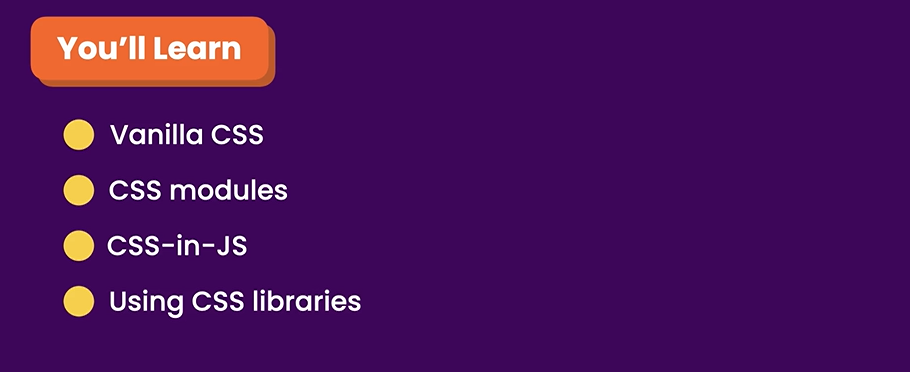
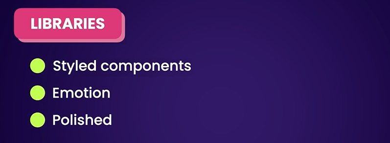

# Styling Components



## Vanilla CSS

```
App.tsx

import ListGroup from "./components/ListGroup/ListGroup"; //need to import first

// this is quite ugly so we create index file in this folder.
```

```
index.ts

import ListGroup from "./ListGroup";

export default ListGroup;

//import list group and export as an object

```

so in App.tsx would be like this

import ListGroup from "./components/ListGroup"; //need to import first

we just simply refer to ListGroup folder without referencing to file because the compiler will look for index file.

we write all the styles in css files and then imported it on the top of the component file

## CSS modules

in css modules all className are stored locally. Cannot access from outside. 

1. Add .module to ListGroup.module.css
2. use camelCase notation

```
ListGroup.module.css

.listGroup{
    list-style: none;
    padding: 0;
}

.container {
    background: yellow;
}
```

```
ListGroup.tsx

import { useState } from "react";
import styles from "./ListGroup.module.css";

// { items: [], heading: string}
interface Props {
  items: string[];
  heading: string;
  // (item: string) => void
  onSelectItem: (item: string) => void;
}

function ListGroup({ items, heading, onSelectItem }: Props) {
  //Hook is features allows us to tap in features that have been built in React
  const [selectedIndex, setSelectedIndex] = useState(-1);

  return (
    <>
      <h1>{heading}</h1>
      {items.length === 0 && <p>No item found</p>}
      <ul className={[styles.ListGroup, styles.container].join(' ')}>
        {items.map((item, index) => (
          <li
            className={
              selectedIndex === index
                ? "list-group-item active"
                : "list-group-item"
            }
            key={item}
            onClick={() => {
              setSelectedIndex(index);
              onSelectItem(item);
            }}
          >
            {item}
          </li>
        ))}
      </ul>
    </>
  );
}

export default ListGroup;
```

## CSS In Js

can write css in Ts or Js



## Separation of Concerns

## Inline Styles

## Popular Ui Libraries

## Adding Icons

## Exercise using Css Modules

## Building a like component
Bulding a reuseable like component

```
Like.tsx

import { useState } from 'react'
import {AiOutlineHeart, AiFillHeart} from 'react-icons/ai'

interface Props{
    onClick: () => void;
}

const Like = ({onClick}:Props) => {
    const [status, setStatus] = useState(true); //state variable

    const toggle = () => {
        setStatus(!status);
        onClick();
    }

    if (status) return (<AiOutlineHeart color='ff6b81' size={30} onClick={toggle}/>)
    return(<AiFillHeart  color='ff6b81' size={30} onClick = {toggle}/>)
}

export default Like

// 1. First render a heart icon
// 2. Declare a state variable to determine of the heart should be full or empty.
// 3. Create interface Props
```

```
App.tsx

import Like from './components/Like';

function App() {


  return (
    <div>
      <Like onClick={() => console.log('Clicked')}/>
    </div>
  );
}

export default App;
```


