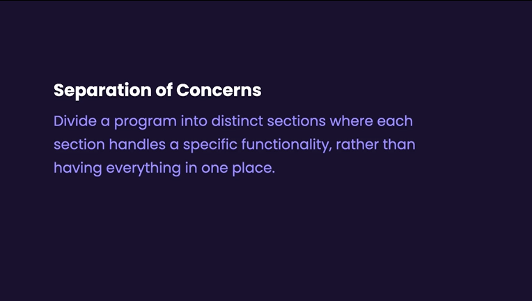
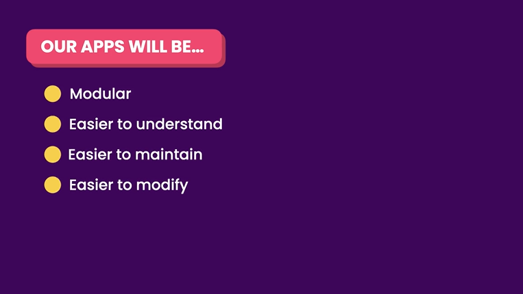
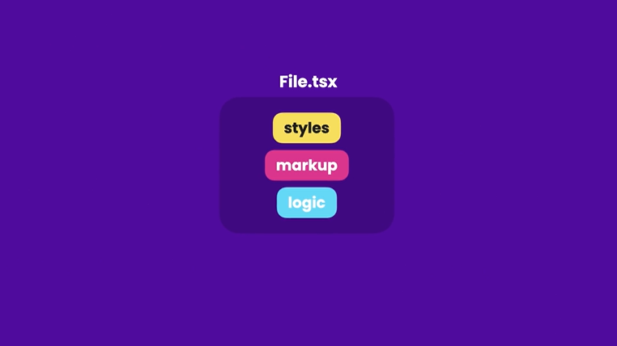
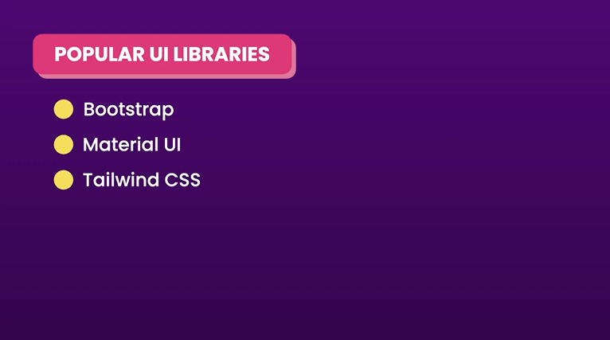

# **Styling Components**


## **Vanilla CSS**

- Remove any third party library from main.tsx
- This import structure in App.tsx is a little bit ugly.
  `import ListGroup from "./components/ListGroup/ListGroup";`
- So we create a new file in ListGroup folder called index.ts
- So now we can remove the file extension in the import statement in the app.tsx. By default, if we just supply the folder, the compiler will search for file that is named as index.

```
import ListGroup from "./components/ListGroup";
```

- Problem with Vanilla CSS is that when we have another stylesheet where we have CSS class with the same name, it will run into clashes. This can be solved by CSS Modules.

## **CSS Modules**

- In css modules is a CSS files in which all class name are scoped locally. Just like Js modules. So can use same class name in different files without being clashes.

1. Amend .module to css file name (in this case ListGroup.module.css)
2. use camelCase notation

```
ListGroup.module.css

.listGroup{
    list-style: none;
    padding: 0;
}

.container {
    background: yellow;
}
```

- If we want to add multiple class, we can wrap into array and use .join method. In this case we use join method with a space.
  `<ul className={[styles.ListGroup, styles.container].joi `

```
ListGroup.tsx

import { useState } from "react";
import styles from "./ListGroup.module.css";

// { items: [], heading: string}
interface Props {
  items: string[];
  heading: string;
  // (item: string) => void
  onSelectItem: (item: string) => void;
}

function ListGroup({ items, heading, onSelectItem }: Props) {
  //Hook is features allows us to tap in features that have been built in React
  const [selectedIndex, setSelectedIndex] = useState(-1);

  return (
    <>
      <h1>{heading}</h1>
      {items.length === 0 && <p>No item found</p>}
      <ul className={[styles.ListGroup, styles.container].join(' ')}>
        {items.map((item, index) => (
          <li
            className={
              selectedIndex === index
                ? "list-group-item active"
                : "list-group-item"
            }
            key={item}
            onClick={() => {
              setSelectedIndex(index);
              onSelectItem(item);
            }}
          >
            {item}
          </li>
        ))}
      </ul>
    </>
  );
}

export default ListGroup;
```

## **CSS In Js**

- Can write css in Ts or Js
  
  

1. Install styled-components
   `npm i styled-components`
2. import dekat component
   `import styled from "styled-components";`
3. Type `styled.` akan keluar list of styles. Boleh pilih
4. Declare as a constant dekat atas sekali sebelum structure.

```
const List = styled.ul`
  .list-group {
    list-style: none;
    padding: 0;
  }
`;
```

5. Call dekat structure based on nama style yang declare as constant tadi.

`List` and `ListItem`

```
      <List>
        {items.map((item, index) => (
          <ListItem
            active={index === selectedIndex}
            key={item}
            onClick={() => {
              setSelectedIndex(index);
            }}
          >
            {item}
          </ListItem>
        ))}
      </List>
```

6. We can style components based on Props
   `active={index === selectedIndex}`

```
interface ListItemProps {
  active: boolean;
}
```

7. Here we use template literals in Ts

```
const ListItem = styled.li<ListItemProps>`
  padding: 5px;
  background: ${(props) => (props.active ? "blue" : "none")};
`;
```

## **Separation of Concerns**





- Like a chef only cook, a waiter only take orders.
  
- In modular, all the complexity is hidden behind a well-defined interfaces.
  

## **Inline Styles**

Takyah Buat la

## Popular Ui Libraries



- MUi used by Google material design. Design language used by Google products
- Tailwind CSS is a utility first CSS library. Akan banyak guna class dalam markup.
- Additional Library is DaisyUi and Chakra Ui

## **Adding Icons**

- Google react icons

```
import { BsFillCalendarFill } from "react-icons/bs";

function App() {
  return (
    <div>
      <BsFillCalendarFill color="purple" size="40" />
    </div>
  );
}

export default App;
```

## **Exercise using CSS Modules**

```
Button.tsx

import styles from "./Button.module.css";

interface Props {
  children: string;
  color?: "primary" | "secondary" | "danger";
  onClick?: () => void;
}

const Button = ({ children, color = "primary", onClick }: Props) => {
  return (
    <button
      className={[styles.btn, styles["btn-" + color]].join(" ")}
      onClick={onClick}
    >
      {children}
    </button>
  );
};

export default Button;
```

```
App.tsx

import Button from "./components/Button/Button";

function App() {
  return (
    <div>
      <Button color="primary">Hi</Button>
    </div>
  );
}

export default App;
```

## **Building a Like Component**

- Bulding a reuseable like component

```
LikeButton.tsx

import { useState } from "react";
import { AiOutlineHeart, AiFillHeart } from "react-icons/ai";

interface Props {
  onClick: () => void;
}

const LikeButton = ({ onClick }: Props) => {
  const [liked, setLiked] = useState(false);

  const toggle = () => {
    setLiked(!liked);
    onClick;
  };
  if (liked) return <AiFillHeart color="#ff6b81" size={20} onClick={toggle} />;
  return <AiOutlineHeart size={20} onClick={toggle} />;
};

export default LikeButton;
```

```
App.tsx

import LikeButton from "./components/LikeButton";

function App() {
  return (
    <div>
      <LikeButton onClick={() => console.log("clicked")} />
    </div>
  );
}

export default App;
```
