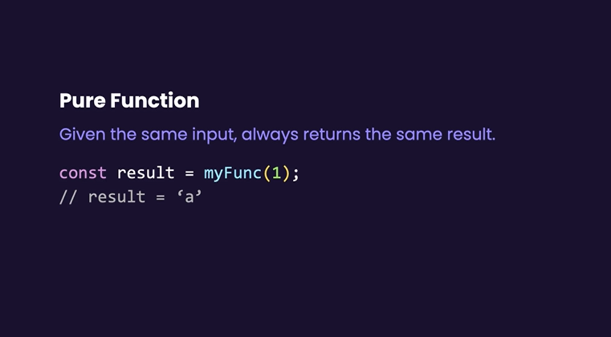
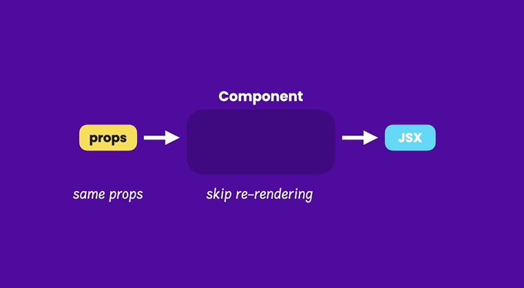
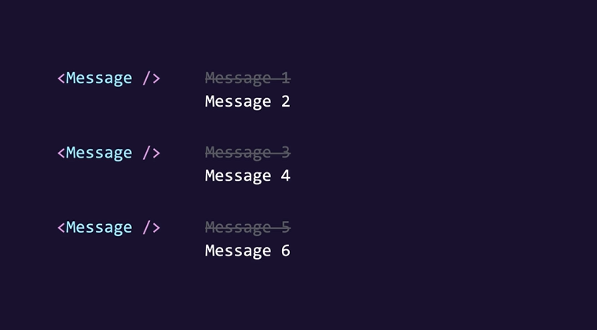
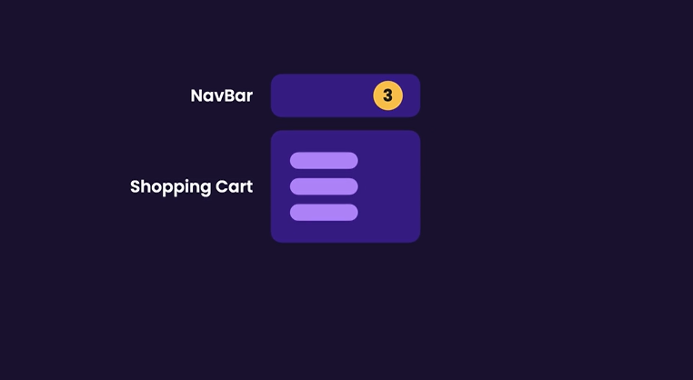

# **Introduction**

## **Understanding The State Hooks**
* State hook is used to add state to a component.
* React updates state asynchronously(meaning not immediately)(for perfomamnce reason)
```
App.tsx

import { useState } from "react";

function App() {
  const [isVisible, setVisibility] = useState(false);

  const handleClick = () => {
    setVisibility(true);
    console.log(isVisible);
  };
  
  return (
    <div>
      <button onClick={handleClick}>Show</button>
    </div>
  );
}

export default App;

//this will still output false on the console.
//the update was not applied immediately
//perfomance wise reasons, we could state multiple state variables, and each time React deal with set function it will rerender for every state.
```
* State is stored outside of components in memory
* Use hooks at the top level of our component

## **Choosing The State Structure**


## **Keeping Components Pure**



* If function called 10 times,the result shoud be the same 10 times but if it's changed it will be recognized as impure.
* If the components is pure react will skip re-rendering.
* To make sure our components pure is by keep changes out of the rendering phase.

## **Understanding The Strict Mode**
* React renders each component twice but just in development mode,in production react will be rendered once.


## **Updating Objects**
* Nak update object ada 2 cara
1. Guna macam Props
```
import { useState } from "react";

function App() {
  const [drink, setDrink] = useState({ title: "Milo", price: 10 });

  const handleClick = () => {
    const newDrink = { title: drink.title, price: 20 };
    setDrink(newDrink);
  };

  return (
    <div>
      <button onClick={handleClick}>Show</button>{drink.price}
    </div>
  );
}

export default App;
```

2. Cara kedua guna spread operator
```
import { useState } from "react";

function App() {
  const [drink, setDrink] = useState({ title: "Milo", price: 10 });

  const handleClick = () => {
    setDrink({ ...drink, price: 20 });
  };

  return (
    <div>
      <button onClick={handleClick}>Show</button>
      {drink.price}
    </div>
  );
}

export default App;
```

## **Updating Nested Objects**
* Ok ni contoh lain
```
import { useState } from "react";

function App() {
  const [customer, setCustomer] = useState({
    name: "Nasih",
    age: 2,
    address: { bandar: "naka", poskod: 37863 },
  });

  const handleClick = () => {
    setCustomer({
      ...customer,
      address: { ...customer.address, poskod: 98367 },
    });
  };

  return (
    <div>
      <button onClick={handleClick}>Show</button>
    </div>
  );
}

export default App;
```

## **Updating Arrays**
```
import { useState } from "react";

function App() {
  const [tags, setTags] = useState(["happy", "cheerful"]);

  const handleClick = () => {
    //add
    setTags([...tags, "excited"]);

    //delete
    setTags(tags.filter((tag) => tag !== "happy"));

    //update
    setTags(tags.map((tag) => (tag === "happy" ? "happiness" : tag)));
  };

  return (
    <div>
      <button onClick={handleClick}>Show</button>
    </div>
  );
}

export default App;

//kalau click kita nak add new item dalam existing array.
```

## **Updating Array of Objects**
```
import { useState } from "react";

function App() {
  const [bugs, setBugs] = useState([
    { id: 1, title: "Bug 1", fixed: false },
    { id: 2, title: "Bug 2", fixed: false },
  ]);

  const handleClick = () => {
    setBugs(bugs.map((bug) => (bug.id === 1 ? { ...bug, fixed: true } : bug)));
  };

  return (
    <div>
      <button onClick={handleClick}>Show</button>
    </div>
  );
}

export default App;
```


## **Simplifying Update Logic with Immer**
* Using Immer library to update our logic
* We want to mark out first bug as fixed
```
import { useState } from "react";
import { produce } from "immer";

function App() {
  const [bugs, setBugs] = useState([
    { id: 1, title: "Bug 1", fixed: false },
    { id: 2, title: "Bug 2", fixed: false },
  ]);

  const handleClick = () => {
    // setBugs(bugs.map((bug) => (bug.id === 1 ? { ...bug, fixed: true } : bug)));

    //draft is a proxy object that records the changes we are going to apply to the bugs array. Draft is a copy of the bugs array and we can freely mutate or modified just like we update the Js object.
    setBugs(
      produce((draft) => {
        const bug = draft.find((bug) => bug.id === 1);
        if (bug) bug.fixed = true;
      })
    );
  };

  return (
    <div>
      {bugs.map((bug) => (
        <p key={bug.id}>
          {bug.title}
          {bug.fixed ? "Fixed" : "New"}
        </p>
      ))}
      <button onClick={handleClick}>Show</button>
    </div>
  );
}

export default App;
```

## **Sharing State Between Components**
* Sometimes we need to share state between components.



```
NavBar.tsx

interface Props {
    cartItemsCount: number
}

const NavBar = ({cartItemsCount}:Props) => {
  return (
    <div>NavBar : {cartItemsCount}</div>
  )
}

export default NavBar
```

```
interface Props {
  cartItems: string[];
  onClear: () => void;
}

const Cart = ({ cartItems, onClear }: Props) => {
  return (
    <>
      <div>Cart</div>
      <ul>
        {cartItems.map((item) => (
          <li key={item}>{item}</li>
        ))}
      </ul>
      <button onClick={onClear}>Clear</button>
    </>
  );
};

export default Cart;
```

```
App.tsx

import { useState } from "react";
import NavBar from "./components/NavBar";
import Cart from "./components/Cart";

function App() {
  const [cartItems, setCartItems] = useState(['Product 1', 'Product 2']);

  const handleClick = () => {
  };

  return (
    <div>
      <NavBar cartItemsCount={cartItems.length}/>
      <Cart cartItems={cartItems} onClear={() => setCartItems([])}/>
    </div>
  );
}

export default App;
```

## **Exercise Updating State**


## **Exercise Building an Expandable Text Components**


