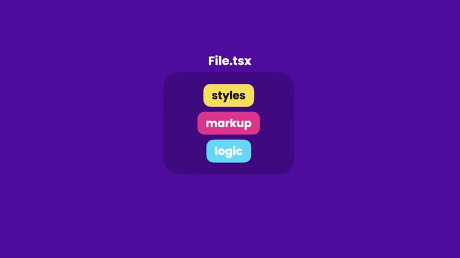
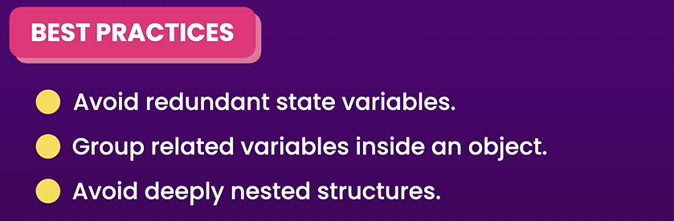
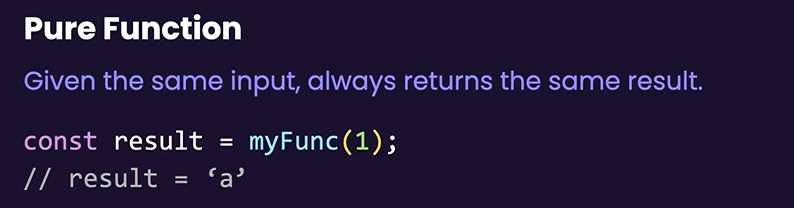
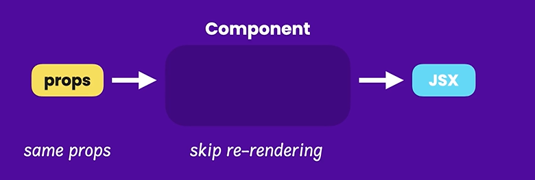
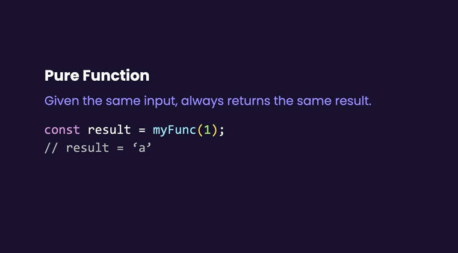
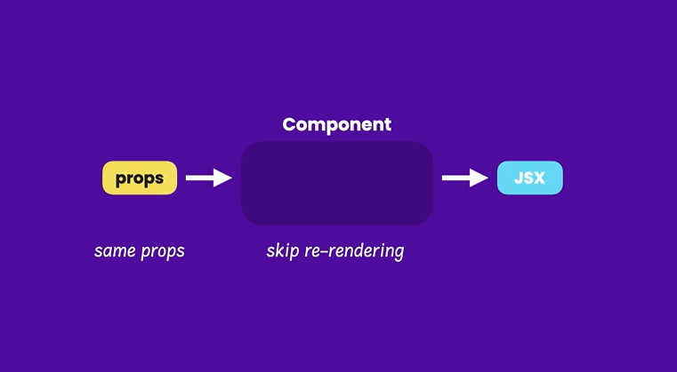
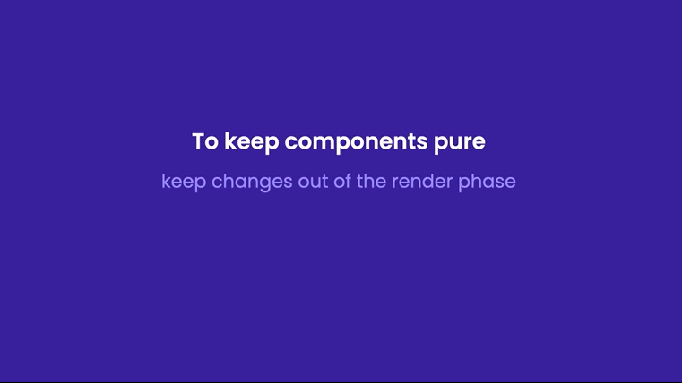

# **Introduction**

## **Understanding The State Hooks**
State hook used to add state to a component
* React updates state asynchronously(meaning not immediately)(for perfomamnce reason)
* State is stored outside of components in memory
* Use hooks at the top level of our component

## Choosing the state structure

## Keeping Components Pure

if function called 10 times,the result shoud be the same 10 times but if it's changed it will be recognized as impure.

If the components is pure react will skip re-rendering.

To make sure our components pure is by keep changes out of the rendering phase

## Understanding the strict mode
react renders each component twice but just in development mode,in production react will be rendered once.

## Updating Objects

## Updating Nested Objects

## Updating Arrays

## Updating Array of Objects

## Simplifying Update Logic with Immer

## Sharing state between components

## Exercise Updating State

## Exercise Building an expandable text components

