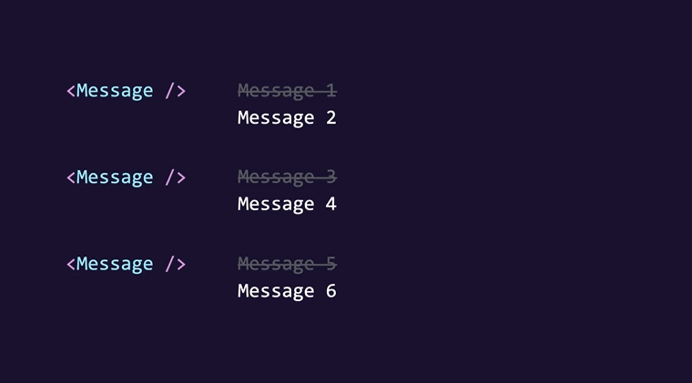

# Introduction
* React Hook Forms for managing form state
* Zod for data validation

## Building a form

```
Form.tsx

import React from "react";

const Form = () => {
  return (
    <form>
      <div className="mb-3">
        <label htmlFor="" className="form-label">
          Name
        </label>
        <input id="name" type="text" className="form-control" />
      </div>
      <div className="mb-3">
        <label htmlFor="age" className="form-label">Age</label>
        <input id="age" type="number" className="form-control" />
      </div>
      <button className="btn btn-primary" type='submit'>Submit</button>
    </form>
  );
};

export default Form;
```

```
index.css

body {
    padding: 20px;
}
```

```
main.tsx

import React from 'react'
import ReactDOM from 'react-dom/client'
import App from './App.tsx'
import 'bootstrap/dist/css/bootstrap.css'
import './index.css'

ReactDOM.createRoot(document.getElementById('root')!).render(
  <React.StrictMode>
    <App />
  </React.StrictMode>,
)
```

```
App.tsx

import Form from './components/Form';

function App() {


  return (
    <div>
      <Form />
    </div>
  );
}

export default App;
```

## Handling Form Submission

```
Form.tsx

import React, { FormEvent } from "react";

const Form = () => {
  const handleSubmit = (event: FormEvent) => {
    event.preventDefault();
    console.log("Submitted");
  };

  return (
    <form onSubmit={handleSubmit}>
      <div className="mb-3">
        <label htmlFor="" className="form-label">
          Name
        </label>
        <input id="name" type="text" className="form-control" />
      </div>
      <div className="mb-3">
        <label htmlFor="age" className="form-label">
          Age
        </label>
        <input id="age" type="number" className="form-control" />
      </div>
      <button className="btn btn-primary" type="submit">
        Submit
      </button>
    </form>
  );
};

export default Form;
```

## Accessing Input Fields

```
Form.tsx

import React, { FormEvent, useRef } from "react";

const Form = () => {
  const nameRef = useRef<HTMLInputElement>(null);
  const ageRef = useRef<HTMLInputElement>(null);
  const person = { name: "", age: 0 };

  const handleSubmit = (event: FormEvent) => {
    event.preventDefault();
    if (nameRef.current !== null) person.name = nameRef.current.value;
    if (ageRef.current !== null) person.age = parseInt(ageRef.current.value);
    console.log(person);
  };

  return (
    <form onSubmit={handleSubmit}>
      <div className="mb-3">
        <label htmlFor="" className="form-label">
          Name
        </label>
        <input ref={nameRef} id="name" type="text" className="form-control" />
      </div>
      <div className="mb-3">
        <label htmlFor="age" className="form-label">
          Age
        </label>
        <input ref={ageRef} id="age" type="number" className="form-control" />
      </div>
      <button className="btn btn-primary" type="submit">
        Submit
      </button>
    </form>
  );
};

export default Form;
```

## Controlled Components

```
form.tsx

import { FormEvent, useState } from "react";

const Form = () => {
  const [person, setPerson] = useState({
    name: "",
    age: "",
  });

  const handleSubmit = (event: FormEvent) => {
    event.preventDefault();
    console.log(person);
  };

  return (
    <form onSubmit={handleSubmit}>
      <div className="mb-3">
        <label htmlFor="" className="form-label">
          Name
        </label>
        <input
          onChange={(event) =>
            setPerson({ ...person, name: event.target.value })
          }
          value={person.name}
          id="name"
          type="text"
          className="form-control"
        />
      </div>
      <div className="mb-3">
        <label htmlFor="age" className="form-label">
          Age
        </label>
        <input
          onChange={(event) =>
            setPerson({ ...person, age: parseInt(event.target.value) })
          }
          value={person.age}
          id="age"
          type="number"
          className="form-control"
        />
      </div>
      <button className="btn btn-primary" type="submit">
        Submit
      </button>
    </form>
  );
};

export default Form;
```

## Managing forms with react hook form

```
Form.tsx

import { FieldValues, useForm } from "react-hook-form";

const Form = () => {
  const {register,handleSubmit}= useForm();

  const onSubmit = (data: FieldValues) => console.log(data);
  
  
  return (
    <form onSubmit={handleSubmit(onSubmit)}>
      <div className="mb-3">
        <label htmlFor="" className="form-label">
          Name
        </label>
        <input
          {...register ('name')}
          id="name"
          type="text"
          className="form-control"
        />
      </div>
      <div className="mb-3">
        <label htmlFor="age" className="form-label">
          Age
        </label>
        <input
          {...register('age')}
          id="age"
          type="number"
          className="form-control"
        />
      </div>
      <button className="btn btn-primary" type="submit">
        Submit
      </button>
    </form>
  );
};

export default Form;
```

## Applying Validation

```
Form.tsx

import { FieldValues, useForm } from "react-hook-form";

interface FormData {
  name: string;
  age: number;
}

const Form = () => {
  const {
    register,
    handleSubmit,
    formState: { errors },
  } = useForm<FormData>();

  const onSubmit = (data: FieldValues) => console.log(data);

  return (
    <form onSubmit={handleSubmit(onSubmit)}>
      <div className="mb-3">
        <label htmlFor="" className="form-label">
          Name
        </label>
        <input
          {...register("name", { required: true, minLength: 3 })}
          id="name"
          type="text"
          className="form-control"
        />
        {errors.name?.type === "required" && (
          <p className="text-danger">The name field is required.</p>
        )}
        {errors.name?.type === "minLength" && (
          <p className="text-danger">The name must be at least 3 characters</p>
        )}
      </div>
      <div className="mb-3">
        <label htmlFor="age" className="form-label">
          Age
        </label>
        <input
          {...register("age")}
          id="age"
          type="number"
          className="form-control"
        />
      </div>
      <button className="btn btn-primary" type="submit">
        Submit
      </button>
    </form>
  );
};

export default Form;
```

## Schema-Based Validation with Zod



Refer to zod.dev


```
From.tsx

import { FieldValues, useForm } from "react-hook-form";
import { z } from "zod";
import { zodResolver } from "@hookform/resolvers/zod";

const schema = z.object({
  name: z.string().min(3, { message: "Name must be at least 3 characters." }),
  age: z
    .number({ invalid_type_error: "Age field is required." })
    .min(18, { message: "Age must be at least 18." }),
});

type FormData = z.infer<typeof schema>;

const Form = () => {
  const {
    register,
    handleSubmit,
    formState: { errors },
  } = useForm<FormData>({ resolver: zodResolver(schema) });

  const onSubmit = (data: FieldValues) => console.log(data);

  return (
    <form onSubmit={handleSubmit(onSubmit)}>
      <div className="mb-3">
        <label htmlFor="" className="form-label">
          Name
        </label>
        <input
          {...register("name")}
          id="name"
          type="text"
          className="form-control"
        />
        {errors.name && <p className="text-danger">{errors.name.message}</p>}
      </div>
      <div className="mb-3">
        <label htmlFor="age" className="form-label">
          Age
        </label>
        <input
          {...register("age", { valueAsNumber: true })}
          id="age"
          type="number"
          className="form-control"
        />
        {errors.age && <p className="text-danger">{errors.age.message}</p>}
      </div>
      <button className="btn btn-primary" type="submit">
        Submit
      </button>
    </form>
  );
};

export default Form;
```
## Disabling the submit button
```
Form.tsx

import { FieldValues, useForm } from "react-hook-form";
import { z } from "zod";
import { zodResolver } from "@hookform/resolvers/zod";

const schema = z.object({
  name: z.string().min(3, { message: "Name must be at least 3 characters." }),
  age: z
    .number({ invalid_type_error: "Age field is required." })
    .min(18, { message: "Age must be at least 18." }),
});

type FormData = z.infer<typeof schema>;

const Form = () => {
  const {
    register,
    handleSubmit,
    formState: { errors, isValid },
  } = useForm<FormData>({ resolver: zodResolver(schema) });

  const onSubmit = (data: FieldValues) => console.log(data);

  return (
    <form onSubmit={handleSubmit(onSubmit)}>
      <div className="mb-3">
        <label htmlFor="" className="form-label">
          Name
        </label>
        <input
          {...register("name")}
          id="name"
          type="text"
          className="form-control"
        />
        {errors.name && <p className="text-danger">{errors.name.message}</p>}
      </div>
      <div className="mb-3">
        <label htmlFor="age" className="form-label">
          Age
        </label>
        <input
          {...register("age", { valueAsNumber: true })}
          id="age"
          type="number"
          className="form-control"
        />
        {errors.age && <p className="text-danger">{errors.age.message}</p>}
      </div>
      <button disabled={!isValid} className="btn btn-primary" type="submit">
        Submit
      </button>
    </form>
  );
};

export default Form;

```
