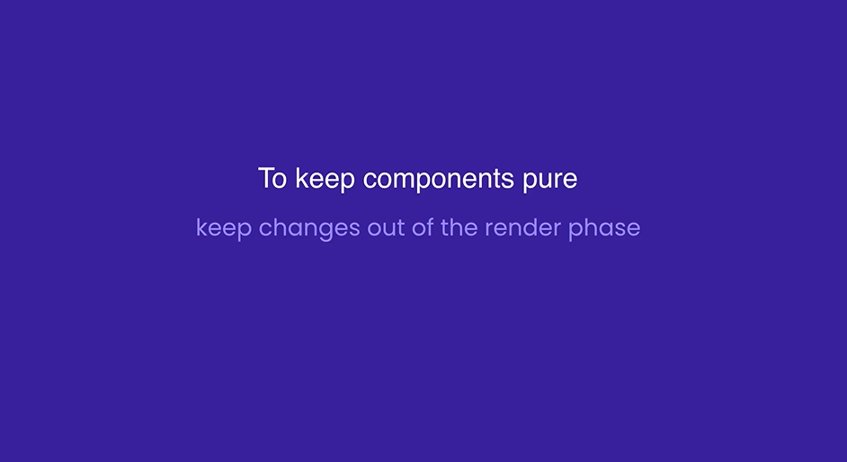

## Intro


## Understanding the Effect Hook
1. Our react component should be a pure function. Pure function should not have any side effect, and should return the same result if we give the same input. 


2. To make our functions or components pure, we have to keep our code outsid of the rendering phase.



With the Effect Hook, we can tell React to execute a piece of code after a component is rendered. 

Before
```
function App() {
  return (
    <div>
      <input type = "text" className = "form-control"/>
    </div>
  );
}

export default App;
```

After
```
import { useEffect, useRef } from "react";

function App() {
  const ref = useRef<HTMLInputElement>(null);

  // afterRender
  useEffect(() => {
    // Side Effect
    if (ref.current) ref.current.focus();
  })

  useEffect(() => {
    document.title = 'My App'
  })

  return (
    <div>
      <input ref = {ref} type="text" className="form-control" />
    </div>
  );
}

export default App;
```

## Effect Dependencies
