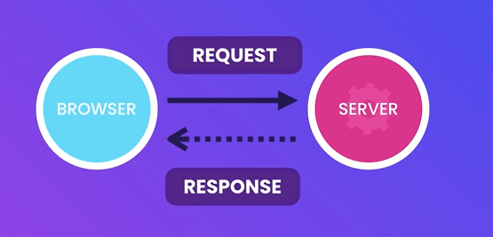

## **Understanding The Effect Hook**


```
import { useEffect, useRef } from "react";

function App() {
  const ref = useRef<HTMLInputElement>(null);

  useEffect(() => {
    if (ref.current) ref.current.focus();
  });

  useEffect(() => {
    document.title = "My App";
  });

  return (
    <div>
      <input ref={ref} type=".text" className="form-control" />
    </div>
  );
}

export default App;
```

## **Effect Dependencies**

```
import React, { useEffect, useState } from "react";

const ProductList = ({ category }: { category: string }) => {
  const [products, setProducts] = useState<string[]>([]);

  useEffect(() => {
    console.log("Fetching products in ", category);
    setProducts(["Clothing", "Household"]);
  }, [category]);
  return <div>ProductList</div>;
};

export default ProductList;
```

```
import { useState } from "react";
import ProductList from "./expense-tracker/components/ProductList";

function App() {
  const [category, setCategory] = useState("");

  return (
    <div>
      <select
        className="form-select"
        onChange={(event) => setCategory(event?.target.value)}
      >
        <option value=""></option>
        <option value="Clothing">Clothing</option>
        <option value="Household">Household</option>
      </select>
      <ProductList category={category} />
    </div>
  );
}

export default App;
```

## **Effect Clean Up**

```
import { useEffect } from "react";

const connect = () => console.log("Connecting");
const disconnect = () => console.log("Disconnecting");

function App() {
  useEffect(() => {
    connect();

    return () => disconnect();
  });
  return <div></div>;
}

export default App;
```

## **Fetching Data**

JsonPlaceHolder


```
import axios from "axios";
import { useEffect, useState } from "react";

interface User {
  id: number;
  name: string;
}

function App() {
  const [users, setUsers] = useState<User[]>([]);

  useEffect(() => {
    axios
      .get<User[]>("https://jsonplaceholder.typicode.com/users")
      .then((res) => setUsers(res.data));
  }, []);
  return (
    <ul>
      {users.map((user) => (
        <li key={user.id}>{user.name}</li>
      ))}
    </ul>
  );
}

export default App;
```

## **Understanding HTTP Requests**





## **Handling Errors**

```
import axios from "axios";
import { useEffect, useState } from "react";

interface User {
  id: number;
  name: string;
}

function App() {
  const [users, setUsers] = useState<User[]>([]);
  const [error, setError] = useState("");

  useEffect(() => {
    axios
      .get<User[]>("https://jsonplaceholder.typicode.com/users")
      .then((res) => setUsers(res.data))
      .catch((err) => setError(err.message));
  }, []);

  return (
    <>
      {error && <p className="text-danger">{error}</p>}
      <ul>
        {users.map((user) => (
          <li key={user.id}>{user.name}</li>
        ))}
      </ul>
    </>
  );
}

export default App;
```

## **Working with Async and Await**

```
import axios, { AxiosError } from "axios";
import { useEffect, useState } from "react";

interface User {
  id: number;
  name: string;
}

function App() {
  const [users, setUsers] = useState<User[]>([]);
  const [error, setError] = useState("");

  useEffect(() => {
    const fetchusers = async () => {
      try {
        const res = await axios.get<User[]>(
          "https://jsonplaceholder.typicode.com/users"
        );
        setUsers(res.data);
      } catch (err) {
        setError((err as AxiosError).message);
      }
    };
    fetchusers();
    //get -> await promise -> response / error
    // .then((res) => setUsers(res.data))
    // .catch((err) => );
  }, []);

  return (
    <>
      {error && <p className="text-danger">{error}</p>}
      <ul>
        {users.map((user) => (
          <li key={user.id}>{user.name}</li>
        ))}
      </ul>
    </>
  );
}

export default App;
```

## **Cancelling a Fetch Request**

```
import axios, { CanceledError } from "axios";
import { useEffect, useState } from "react";

interface User {
  id: number;
  name: string;
}

function App() {
  const [users, setUsers] = useState<User[]>([]);
  const [error, setError] = useState("");

  useEffect(() => {
    const controller = new AbortController();

    axios
      .get<User[]>("https://jsonplaceholder.typicode.com/users", {
        signal: controller.signal,
      })
      .then((res) => setUsers(res.data))
      .catch((err) => {
        if (err instanceof CanceledError) return;
        setError(err.message)});
    return () => controller.abort();
  }, []);

  return (
    <>
      {error && <p className="text-danger">{error}</p>}
      <ul>
        {users.map((user) => (
          <li key={user.id}>{user.name}</li>
        ))}
      </ul>
    </>
  );
}

export default App;
```

## **Showing a Loading Indicator**

```
import axios, { CanceledError } from "axios";
import { useEffect, useState } from "react";

interface User {
  id: number;
  name: string;
}

function App() {
  const [users, setUsers] = useState<User[]>([]);
  const [error, setError] = useState("");
  const [isLoading, setLoading] = useState(false);

  useEffect(() => {
    const controller = new AbortController();

    setLoading(true);
    axios
      .get<User[]>("https://jsonplaceholder.typicode.com/users", {
        signal: controller.signal,
      })
      .then((res) => {
        setUsers(res.data);
        setLoading(false);
      })
      .catch((err) => {
        if (err instanceof CanceledError) return;
        setError(err.message);
        setLoading(false);
      });

    return () => controller.abort();
  }, []);

  return (
    <>
      {error && <p className="text-danger">{error}</p>}
      {isLoading && <div className="spinner-loader"></div>}
      <ul>
        {users.map((user) => (
          <li key={user.id}>{user.name}</li>
        ))}
      </ul>
    </>
  );
}

export default App;
```

## **Deleting Data**


```
import axios, { CanceledError } from "axios";
import { useEffect, useState } from "react";

interface User {
  id: number;
  name: string;
}

function App() {
  const [users, setUsers] = useState<User[]>([]);
  const [error, setError] = useState("");
  const [isLoading, setLoading] = useState(false);

  useEffect(() => {
    const controller = new AbortController();

    setLoading(true);
    axios
      .get<User[]>("https://jsonplaceholder.typicode.com/users", {
        signal: controller.signal,
      })
      .then((res) => {
        setUsers(res.data);
        setLoading(false);
      })
      .catch((err) => {
        if (err instanceof CanceledError) return;
        setError(err.message);
        setLoading(false);
      });

    return () => controller.abort();
  }, []);

  const deleteUser = (user: User) => {
    const originalUsers = [...users];
    setUsers(users.filter((u) => u.id !== user.id));

    axios
      .delete("https://jsonplaceholder.typicode.com/users/" + user.id)
      .catch((err) => {
        setError(err.message);
        setUsers(originalUsers);
      });
  };

  return (
    <>
      {error && <p className="text-danger">{error}</p>}
      {isLoading && <div className="spinner-loader"></div>}
      <ul className="list-group">
        {users.map((user) => (
          <li
            key={user.id}
            className="list-group-item d-flex justify-content-between"
          >
            {user.name}
            <button
              className="btn btn-outline-danger"
              onClick={() => deleteUser(user)}
            >
              Delete
            </button>
          </li>
        ))}
      </ul>
    </>
  );
}

export default App;
```

## **Creating Data**

```
import axios, { CanceledError } from "axios";
import { useEffect, useState } from "react";

interface User {
  id: number;
  name: string;
}

function App() {
  const [users, setUsers] = useState<User[]>([]);
  const [error, setError] = useState("");
  const [isLoading, setLoading] = useState(false);

  useEffect(() => {
    const controller = new AbortController();

    setLoading(true);
    axios
      .get<User[]>("https://jsonplaceholder.typicode.com/users", {
        signal: controller.signal,
      })
      .then((res) => {
        setUsers(res.data);
        setLoading(false);
      })
      .catch((err) => {
        if (err instanceof CanceledError) return;
        setError(err.message);
        setLoading(false);
      });

    return () => controller.abort();
  }, []);

  const deleteUser = (user: User) => {
    const originalUsers = [...users];
    setUsers(users.filter((u) => u.id !== user.id));

    axios
      .delete("https://jsonplaceholder.typicode.com/users/" + user.id)
      .catch((err) => {
        setError(err.message);
        setUsers(originalUsers);
      });
  };

  const addUser = () => {
    const originaluser = [...users];
    const newUser = { id: 0, name: "Syakir" };
    setUsers([...users, newUser]);

    axios
      .post("https://jsonplaceholder.typicode.com/users/", newUser)
      .then(({ data: savedUser }) => setUsers([savedUser, ...users]))
      .catch((err) => {
        setError(err.message);
        setUsers(originaluser);
      });
  };

  return (
    <>
      {error && <p className="text-danger">{error}</p>}
      {isLoading && <div className="spinner-loader"></div>}
      <button className="btn btn-primary mb-3" onClick={addUser}>
        Add
      </button>
      <ul className="list-group">
        {users.map((user) => (
          <li
            key={user.id}
            className="list-group-item d-flex justify-content-between"
          >
            {user.name}
            <button
              className="btn btn-outline-danger"
              onClick={() => deleteUser(user)}
            >
              Delete
            </button>
          </li>
        ))}
      </ul>
    </>
  );
}

export default App;
```

## **Updating Data**

```
import axios, { CanceledError } from "axios";
import { useEffect, useState } from "react";

interface User {
  id: number;
  name: string;
}

function App() {
  const [users, setUsers] = useState<User[]>([]);
  const [error, setError] = useState("");
  const [isLoading, setLoading] = useState(false);

  useEffect(() => {
    const controller = new AbortController();

    setLoading(true);
    axios
      .get<User[]>("https://jsonplaceholder.typicode.com/users", {
        signal: controller.signal,
      })
      .then((res) => {
        setUsers(res.data);
        setLoading(false);
      })
      .catch((err) => {
        if (err instanceof CanceledError) return;
        setError(err.message);
        setLoading(false);
      });

    return () => controller.abort();
  }, []);

  const deleteUser = (user: User) => {
    const originalUsers = [...users];
    setUsers(users.filter((u) => u.id !== user.id));

    axios
      .delete("https://jsonplaceholder.typicode.com/users/" + user.id)
      .catch((err) => {
        setError(err.message);
        setUsers(originalUsers);
      });
  };

  const addUser = () => {
    const originaluser = [...users];
    const newUser = { id: 0, name: "Syakir" };
    setUsers([...users, newUser]);

    axios
      .post("https://jsonplaceholder.typicode.com/users/", newUser)
      .then(({ data: savedUser }) => setUsers([savedUser, ...users]))
      .catch((err) => {
        setError(err.message);
        setUsers(originaluser);
      });
  };

  const updateUser = (user: User) => {
    const originalUsers = [...users];
    const updatedUser = { ...user, name: user.name + "!" };
    setUsers(users.map((u) => (u.id === user.id ? updatedUser : u)));

    axios
      .patch(
        "https://jsonplaceholder.typicode.com/users/" + user.id,
        updatedUser
      )
      .catch((err) => {
        setError(err.message);
        setUsers(originalUsers);
      });
  };

  return (
    <>
      {error && <p className="text-danger">{error}</p>}
      {isLoading && <div className="spinner-loader"></div>}
      <button className="btn btn-primary mb-3" onClick={addUser}>
        Add
      </button>
      <ul className="list-group">
        {users.map((user) => (
          <li
            key={user.id}
            className="list-group-item d-flex justify-content-between"
          >
            {user.name}
            <div>
              <button
                className="btn btn-outline-secondary mx-2"
                onClick={() => updateUser(user)}
              >
                Update
              </button>
              <button
                className="btn btn-outline-danger"
                onClick={() => deleteUser(user)}
              >
                Delete
              </button>
            </div>
          </li>
        ))}
      </ul>
    </>
  );
}

export default App;
```

## **Extracting a Reusable API Client**

```
import axios, {CanceledError} from 'axios';

export default axios.create({
    baseURL: 'https://jsonplaceholder.typicode.com'
})

export {CanceledError};
```

```
import { useEffect, useState } from "react";
import apiClient, { CanceledError } from "./services/api-client";

interface User {
  id: number;
  name: string;
}

function App() {
  const [users, setUsers] = useState<User[]>([]);
  const [error, setError] = useState("");
  const [isLoading, setLoading] = useState(false);

  useEffect(() => {
    const controller = new AbortController();

    setLoading(true);
    apiClient
      .get<User[]>("/users", {
        signal: controller.signal,
      })
      .then((res) => {
        setUsers(res.data);
        setLoading(false);
      })
      .catch((err) => {
        if (err instanceof CanceledError) return;
        setError(err.message);
        setLoading(false);
      });

    return () => controller.abort();
  }, []);

  const deleteUser = (user: User) => {
    const originalUsers = [...users];
    setUsers(users.filter((u) => u.id !== user.id));

    apiClient.delete("/users/" + user.id).catch((err) => {
      setError(err.message);
      setUsers(originalUsers);
    });
  };

  const addUser = () => {
    const originaluser = [...users];
    const newUser = { id: 0, name: "Syakir" };
    setUsers([...users, newUser]);

    apiClient
      .post("/users/", newUser)
      .then(({ data: savedUser }) => setUsers([savedUser, ...users]))
      .catch((err) => {
        setError(err.message);
        setUsers(originaluser);
      });
  };

  const updateUser = (user: User) => {
    const originalUsers = [...users];
    const updatedUser = { ...user, name: user.name + "!" };
    setUsers(users.map((u) => (u.id === user.id ? updatedUser : u)));

    apiClient.patch("/users/" + user.id, updatedUser).catch((err) => {
      setError(err.message);
      setUsers(originalUsers);
    });
  };

  return (
    <>
      {error && <p className="text-danger">{error}</p>}
      {isLoading && <div className="spinner-loader"></div>}
      <button className="btn btn-primary mb-3" onClick={addUser}>
        Add
      </button>
      <ul className="list-group">
        {users.map((user) => (
          <li
            key={user.id}
            className="list-group-item d-flex justify-content-between"
          >
            {user.name}
            <div>
              <button
                className="btn btn-outline-secondary mx-2"
                onClick={() => updateUser(user)}
              >
                Update
              </button>
              <button
                className="btn btn-outline-danger"
                onClick={() => deleteUser(user)}
              >
                Delete
              </button>
            </div>
          </li>
        ))}
      </ul>
    </>
  );
}

export default App;
```

## **Extracting the User Service**

```
import apiClient from "./api-client";

export interface User {
    id: number;
    name: string;
  }


class UserService{
    getAllUsers() {
        const controller = new AbortController();
        const request = apiClient
        .get<User[]>("/users", {
          signal: controller.signal,
        })
        return{request, cancel:() => controller.abort()}
    }
    deleteUser(id: number){
        return apiClient.delete("/users/" + id)
    }
    createUser (user: User) {
        return apiClient.post("/users/", user);
    }

    updateUser(user: User){
        return apiClient.patch("/users/" + user.id, user)
    }
}

export default new UserService();
```

```
import { useEffect, useState } from "react";
import { CanceledError } from "./services/api-client";
import userService, { User } from "./services/user-service";

function App() {
  const [users, setUsers] = useState<User[]>([]);
  const [error, setError] = useState("");
  const [isLoading, setLoading] = useState(false);

  useEffect(() => {
    setLoading(true);
    const { request, cancel } = userService.getAllUsers();
    request
      .then((res) => {
        setUsers(res.data);
        setLoading(false);
      })
      .catch((err) => {
        if (err instanceof CanceledError) return;
        setError(err.message);
        setLoading(false);
      });

    return () => cancel();
  }, []);

  const deleteUser = (user: User) => {
    const originalUsers = [...users];
    setUsers(users.filter((u) => u.id !== user.id));

    userService.deleteUser(user.id).catch((err) => {
      setError(err.message);
      setUsers(originalUsers);
    });
  };

  const addUser = () => {
    const originaluser = [...users];
    const newUser = { id: 0, name: "Syakir" };
    setUsers([...users, newUser]);

    userService
      .createUser(newUser)
      .then(({ data: savedUser }) => setUsers([savedUser, ...users]))
      .catch((err) => {
        setError(err.message);
        setUsers(originaluser);
      });
  };

  const updateUser = (user: User) => {
    const originalUsers = [...users];
    const updatedUser = { ...user, name: user.name + "!" };
    setUsers(users.map((u) => (u.id === user.id ? updatedUser : u)));

    userService.updateUser(updatedUser).catch((err) => {
      setError(err.message);
      setUsers(originalUsers);
    });
  };

  return (
    <>
      {error && <p className="text-danger">{error}</p>}
      {isLoading && <div className="spinner-loader"></div>}
      <button className="btn btn-primary mb-3" onClick={addUser}>
        Add
      </button>
      <ul className="list-group">
        {users.map((user) => (
          <li
            key={user.id}
            className="list-group-item d-flex justify-content-between"
          >
            {user.name}
            <div>
              <button
                className="btn btn-outline-secondary mx-2"
                onClick={() => updateUser(user)}
              >
                Update
              </button>
              <button
                className="btn btn-outline-danger"
                onClick={() => deleteUser(user)}
              >
                Delete
              </button>
            </div>
          </li>
        ))}
      </ul>
    </>
  );
}

export default App;
```

## **Creating a Generic HTTP Service**

```
import apiClient from "./api-client";

interface Entity {
    id: number;
}

class HttpService{

    endpoint: string;

    constructor(endpoint: string) {
        this.endpoint = endpoint;
    }

    getAll<T>() {
        const controller = new AbortController();
        const request = apiClient
        .get<T[]>(this.endpoint, {
          signal: controller.signal,
        })
        return{request, cancel:() => controller.abort()}
    }
    delete(id: number){
        return apiClient.delete(this.endpoint + "/" + id)
    }
    create<T> (entity: T) {
        return apiClient.post(this.endpoint, entity);
    }

    update<T extends Entity>(entity: T){
        return apiClient.patch(this.endpoint + "/" + entity.id, entity)
    }
}

const create = (endpoint: string) => new HttpService(endpoint);

export default create;
```

```
import create from "./http-service";


export interface User {
    id: number;
    name: string;
  }

export default create('/users');
```

```
import { useEffect, useState } from "react";
import { CanceledError } from "./services/api-client";
import userService, { User } from "./services/user-service";

function App() {
  const [users, setUsers] = useState<User[]>([]);
  const [error, setError] = useState("");
  const [isLoading, setLoading] = useState(false);

  useEffect(() => {
    setLoading(true);
    const { request, cancel } = userService.getAll<User>();
    request
      .then((res) => {
        setUsers(res.data);
        setLoading(false);
      })
      .catch((err) => {
        if (err instanceof CanceledError) return;
        setError(err.message);
        setLoading(false);
      });

    return () => cancel();
  }, []);

  const deleteUser = (user: User) => {
    const originalUsers = [...users];
    setUsers(users.filter((u) => u.id !== user.id));

    userService.delete(user.id).catch((err) => {
      setError(err.message);
      setUsers(originalUsers);
    });
  };

  const addUser = () => {
    const originaluser = [...users];
    const newUser = { id: 0, name: "Syakir" };
    setUsers([...users, newUser]);

    userService
      .create(newUser)
      .then(({ data: savedUser }) => setUsers([savedUser, ...users]))
      .catch((err) => {
        setError(err.message);
        setUsers(originaluser);
      });
  };

  const updateUser = (user: User) => {
    const originalUsers = [...users];
    const updatedUser = { ...user, name: user.name + "!" };
    setUsers(users.map((u) => (u.id === user.id ? updatedUser : u)));

    userService.update(updatedUser).catch((err) => {
      setError(err.message);
      setUsers(originalUsers);
    });
  };

  return (
    <>
      {error && <p className="text-danger">{error}</p>}
      {isLoading && <div className="spinner-loader"></div>}
      <button className="btn btn-primary mb-3" onClick={addUser}>
        Add
      </button>
      <ul className="list-group">
        {users.map((user) => (
          <li
            key={user.id}
            className="list-group-item d-flex justify-content-between"
          >
            {user.name}
            <div>
              <button
                className="btn btn-outline-secondary mx-2"
                onClick={() => updateUser(user)}
              >
                Update
              </button>
              <button
                className="btn btn-outline-danger"
                onClick={() => deleteUser(user)}
              >
                Delete
              </button>
            </div>
          </li>
        ))}
      </ul>
    </>
  );
}

export default App;
```

## **Creating a Custom Data Fetching Hook**

```
import { useEffect, useState } from "react";
import userService, { User } from "../services/user-service";
import { CanceledError } from "../services/api-client";

const useUsers = () => {
    const [users, setUsers] = useState<User[]>([]);
    const [error, setError] = useState("");
    const [isLoading, setLoading] = useState(false);

    useEffect(() => {
      setLoading(true);
      const { request, cancel } = userService.getAll<User>();
      request
        .then((res) => {
          setUsers(res.data);
          setLoading(false);
        })
        .catch((err) => {
          if (err instanceof CanceledError) return;
          setError(err.message);
          setLoading(false);
        });

      return () => cancel();
    }, []);
    return{users, error, isLoading, setUsers, setError};

}

export default useUsers;
```

```
import userService, { User } from "./services/user-service";
import useUsers from "./hooks/useUsers";

function App() {
  const { users, error, isLoading, setUsers, setError } = useUsers();

  const deleteUser = (user: User) => {
    const originalUsers = [...users];
    setUsers(users.filter((u) => u.id !== user.id));

    userService.delete(user.id).catch((err) => {
      setError(err.message);
      setUsers(originalUsers);
    });
  };

  const addUser = () => {
    const originaluser = [...users];
    const newUser = { id: 0, name: "Syakir" };
    setUsers([...users, newUser]);

    userService
      .create(newUser)
      .then(({ data: savedUser }) => setUsers([savedUser, ...users]))
      .catch((err) => {
        setError(err.message);
        setUsers(originaluser);
      });
  };

  const updateUser = (user: User) => {
    const originalUsers = [...users];
    const updatedUser = { ...user, name: user.name + "!" };
    setUsers(users.map((u) => (u.id === user.id ? updatedUser : u)));

    userService.update(updatedUser).catch((err) => {
      setError(err.message);
      setUsers(originalUsers);
    });
  };

  return (
    <>
      {error && <p className="text-danger">{error}</p>}
      {isLoading && <div className="spinner-loader"></div>}
      <button className="btn btn-primary mb-3" onClick={addUser}>
        Add
      </button>
      <ul className="list-group">
        {users.map((user) => (
          <li
            key={user.id}
            className="list-group-item d-flex justify-content-between"
          >
            {user.name}
            <div>
              <button
                className="btn btn-outline-secondary mx-2"
                onClick={() => updateUser(user)}
              >
                Update
              </button>
              <button
                className="btn btn-outline-danger"
                onClick={() => deleteUser(user)}
              >
                Delete
              </button>
            </div>
          </li>
        ))}
      </ul>
    </>
  );
}

export default App;
```
