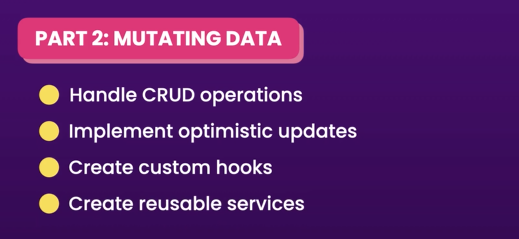
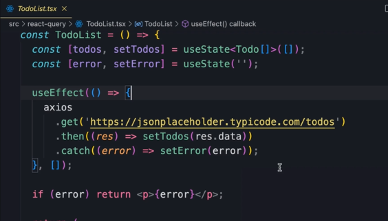
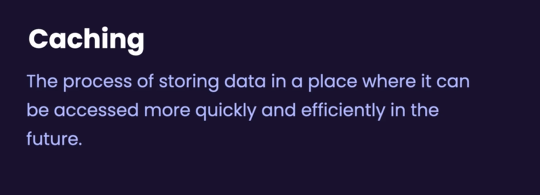
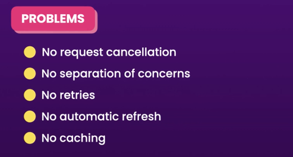

# **React Query**

* Fetching and Updating Data. 

Part 3 : 
* Caching
* Infinite Scrolling
* Refactor

## **What is react query**

Using axios:
* No request cancellation
* No separation of concerns
* No retries
* No automatic refresh
* No caching

